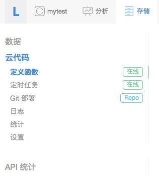
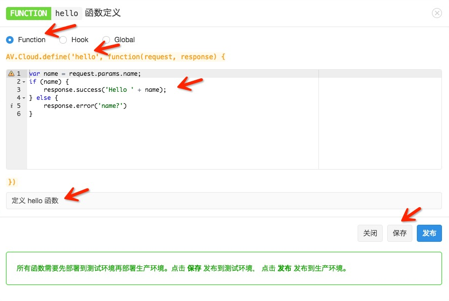
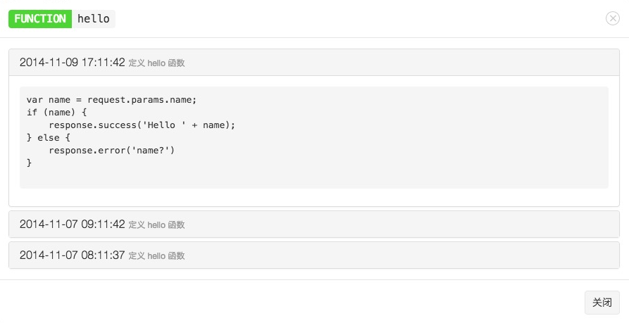
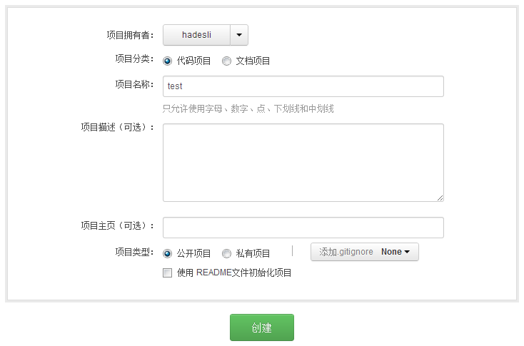
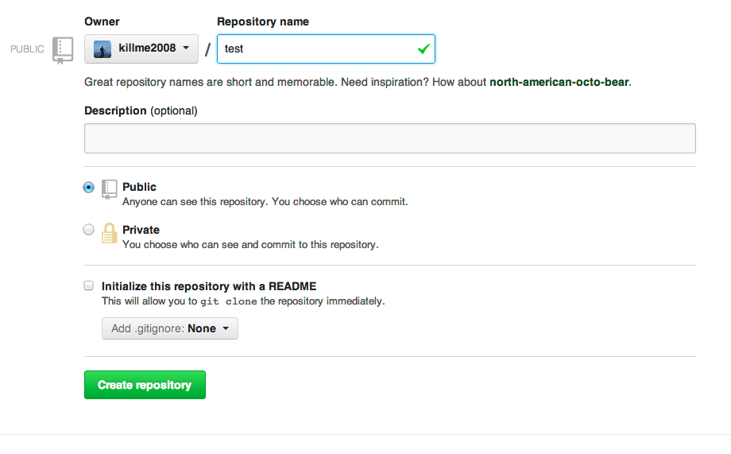
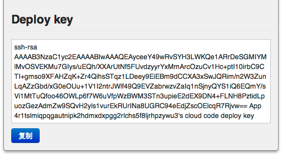
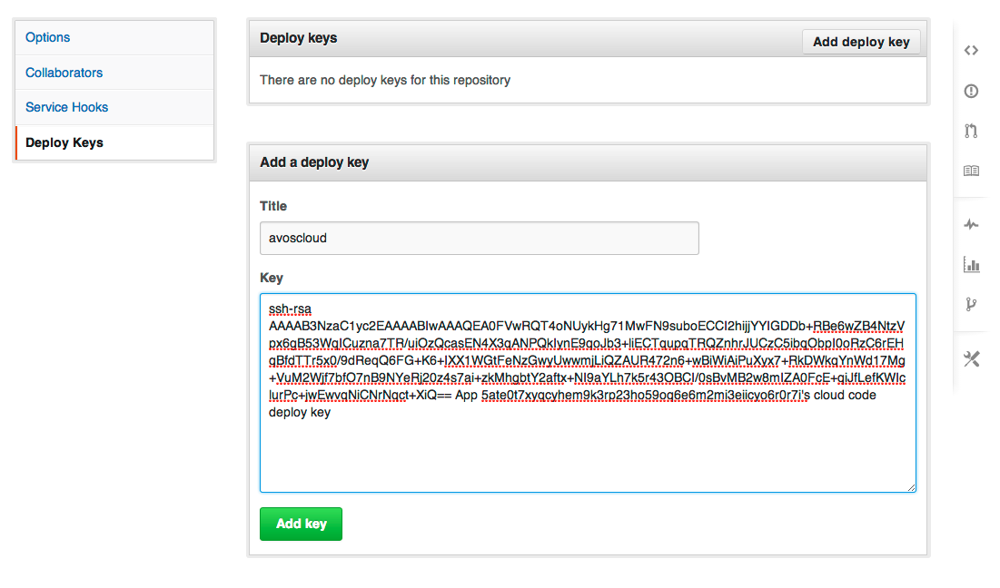
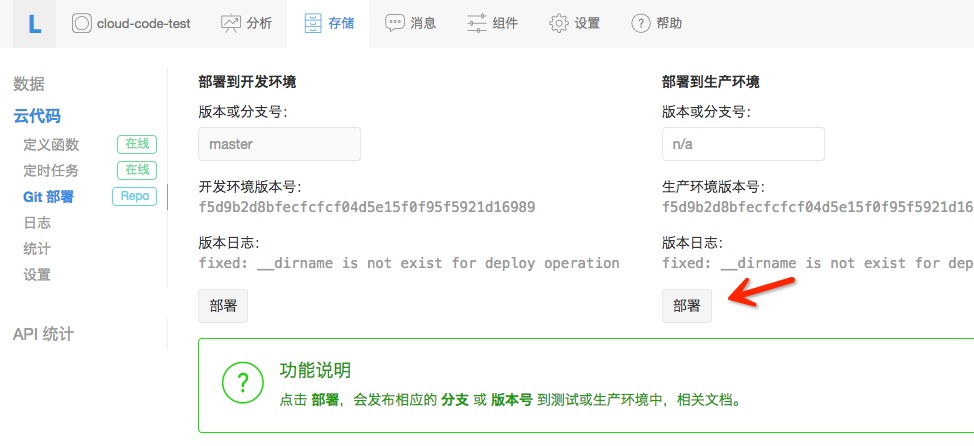
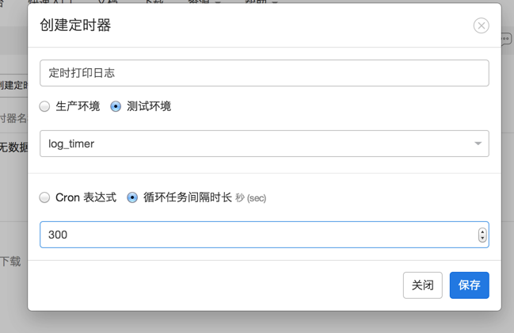

# 云代码指南

## 介绍

为了在服务端执行一些业务逻辑操作，你需要使用我们提供的Cloud Code功能，编写JavaScript代码，并部署到我们的平台上。通过Cloud Code，你可以拦截save请求，在save object之前或之后做一些事情。你也可以自定义业务函数，并通过SDK调用。你还可以调用部分第三方库来实现你的业务逻辑。甚至，你可以将整个网站架设在Cloud Code之上，我们提供了web hosting服务。详细介绍如下。

## 云代码 2.0 版

2014 年 8 月 14 号，Cloud Code 推出 2.0 版本，最主要特性：可以自由添加和使用三方类库，去除一些对模块的限制。从 14 号开始，新创建的应用都将使用云代码2.0版本。

### 升级到 2.0

1. 时区问题：2.0版彻底修复了时区问题，应用不再需要自己对时间做 8 小时的时区修正。所以需要确认，在迁移到云代码2.0之前，移除代码中之前对时间修正的部分代码。
1. 引入 package.json （可选）：如果项目需要引入其他三方类库，可以像标准 node.js 项目一样，在项目根目录添加一个 `package.json` 配置文件，下面是一个简单的样例：

```json
{
    "name": "cloud-code-test",
    "description": "Cloud Code test project.",
    "version": "0.0.1",
    "private": true,
    "dependencies": {
        "async": "0.9.x"
    }
}
```

需要注意的是，cloud-code 运行环境默认包含一些组件，如果 `package.json` 指定明确版本则以用户自定义的为准，否则使用下面的默认版本：

```
nodejs: "0.10.29"
qiniu: "6.1.3"
underscore: "1.6.0"
underscore.string: "2.3.3"
moment: "2.7.0"
express-ejs-layouts: "0.3.1"
weibo: "0.6.9"
node-qiniu: "6.1.6"
mailgun: "0.4.2"
mandrill: "0.1.0"
stripe: "2.5.0"
sendgrid: "1.0.5"
xml2js: "0.4.4"
```

**注意**：`express` 目前只支持 `3.4.x` 版本，即使 `package.json` 指定其他版本也是无效的。

在以上问题都确认后，就可以进行升级动作。升级操作完成后，因为缓存的原因，需要等待最多5分钟，平台将自动迁移完成，在5分钟迁移时间内，老的云代码将继续提供服务，因此无需担心迁移期间服务暂停。

### 最新特性

* 有着更好的资源隔离机制，因此 `fs` 等官方模块的限制取消了。
* 可以自由添加和使用三方类库
* 时区问题彻底解决
* `views` 目录不再需要分成两个目录（ `cloud/views` 和 `cloud/dev_views` ）
* 修正：项目从代码仓库迁出有可能失败的问题

## JavaScript指南

云代码可以完全运行所有JavaScript SDK提供的功能，但是不提供浏览器的localStorage存储。查看[《JavaScript SDK开发指南》](./js_guide.html)。

## 安装命令行工具

推荐安装基于 node.js 的`avoscloud`命令行工具，通过该工具可以创建、部署、发布、回滚、查询云代码，并且支持多应用管理。

详细请查看 [云代码命令行工具详解](./cloud_code_commandline.html)

## Cloud code 管理

首先，请进入App的[云代码管理](/cloud.html?appid={{appid}}#/repository)界面：



可以看到左侧菜单：

* 定义函数：Cloud Code 的简单模式，可以直接在线维护云代码方法。
* 定时任务：可以设置一些定时任务，比如每天凌晨清理无用数据等。
* 代码库：用来设置项目的源码仓库信息，包括从这里可以下载 Cloud Code 项目的初始框架代码，拷贝用于私有 git 仓库的 deploy key 等。
* 部署：用于部署 Cloud Code到测试环境或者生产环境。
* 日志：用于查看 Cloud Code日志
* 统计：用于查看 Cloud Code 的一些数据统计

### 定义函数

很多人使用 Cloud Code 是为了在服务端提供一些个性化的方法供各终端调用，而不希望关心诸如代码托管、npm 依赖管理等问题。为此我们提供了在线维护 Cloud Code 的功能。

#### 提醒

使用此功能，你需要注意：

* 会替代你之前 git 或者命令行部署的项目。
* 暂不提供 webHosting 功能。
* 维护的所有函数可以生成并导出一个完整的项目，供 git 或命令行部署（即将推出）。


左上角的「创建函数」可以新创建一个函数。中间部分是已经创建好的函数，并可以进行一些维护操作。

#### 函数类型

有几种函数类型：

* Function：对应 `AV.Cloud.define` 定义的方法。
* Hook：对应 `AV.Cloud.beforeSave` 等回调定义的方法。
* Global：对应全局变量，一些全局变量和公共函数可以定义在这里。

这些函数的使用场景和具体细节，参见 [Cloud 函数](#cloud-函数)

#### 创建函数

如果需要创建一个新的函数，可以点击「创建函数」按钮，你将看到如下窗口：



你需要设置的部分包括：

* 函数类型
* 函数名称
* 数据具体的代码片段（注意，你不需要输入函数定义部分，即 `AV.Cloud.define(...)` 部分）
* 注释
* 全部 OK 后点击「保存」，或者放弃编辑点击「关闭」

你可以在代码框中填入下列代码：

```javascript
var name = request.params.name;
if (name) {
    response.success('Hello ' + name);
} else {
    response.error('name?')
}
```


点击保存后，Cloud Code 会在后台编译、保存，并将代码部署到「测试环境」，这个过程可能需要十几秒钟的时间，请耐心等待。全部完成后，页面上方会提示「已更新到测试环境」；如果有错误（比如编译错误）则会出现类似提示：`加载代码出错: SyntaxError: Unexpected token )`。

#### 发布

如果函数部署「测试环境」成功，就可以点击「发布」按钮将函数发布到「生产环境」。同样该过程可能需要十几秒钟的时间，请耐心等待。全部完成后，页面上方会提示「已发布到生产环境」。

#### 同步

对于某个函数，可能生产环境运行一个版本，而测试环境正在开发一个新的版本，两个环境的代码是不一致的，这时函数列表页面相关函数的「测试环境」按钮会变成蓝色：


当你在测试环境开发完成，点击「发布」后，两个环境的代码将会统一，这时「测试环境」按钮变为灰色。

#### 测试

如果需要测试，可以点击相应函数的「调用」按钮，你将看到如下窗口：


选择调用环境，并输入调用参数，点击「运行」按钮即可看到调用结果。如果调用返回的 `Http Status Code` 不是 `200`，则页面上方会提示相关错误信息。

#### 历史版本

如果你想看某个函数之前曾经部署过的代码，可以在函数列表页面点击「历史」按钮，将会弹出类似下面的窗口：



你可以点击时间来查看不同时间部署的代码。

#### 删除

如果你确定某个函数已经不再需要，可以在函数列表页面点击「删除」按钮将其删除。**注意**：删除后该函数和其所有历史记录都将被删除，而且不能恢复。删除动作会重新部署测试和生产环境，这个过程可能需要十几秒钟的时间，请耐心等待。


### 代码库

如果你希望自己通过项目的方式维护 Cloud Code 代码，可以使用 `代码库` 的相关功能。

点击`代码库`菜单的`下载项目框架(基本版)`链接，会自动下载一个初始的项目框架，下载后的文件是一个zip打包文件，请解压该文件，会看到一个以App名称命名的目录，进入该目录会看到三个文件夹：


目录结构是这样：

```
-config/
  global.json
-cloud/
  main.js
-public/
  README
```
其中：

* public目录，用于存放[Web Hosting](#web-hosting)功能的静态资源文件，具体请看后面的介绍。
* config目录下是项目的配置文件`global.json`，已经按照你的项目信息（主要是App id和App key）帮你自动配置好了。
* cloud目录下有一个`main.js`，这就是你的业务逻辑代码存放的地方，初始内容定义了一个函数，代码如下：

```javascript
// Use AV.Cloud.define to define as many cloud functions as you want.
// For example:
AV.Cloud.define("hello", function(request, response) {
  response.success("Hello world!");
});
```

这段代码定义了一个名为`hello`的函数，它简单的返回应答`Hello world!`。

### 部署代码

我们可以直接将这个初步的项目框架部署到Cloud Code上尝试运行一下。

首先，你需要将这个项目提交到一个git仓库,LeanCloud并不提供源码的版本管理功能，而是借助于git这个优秀的分布式版本管理工具。我们推荐您使用[CSDN Code平台](https://code.csdn.net/)，[github](https://github.com/)或者[BitBucket](https://bitbucket.org/)这样第三方的源码
托管网站，也可以使用您自己搭建的git仓库(比如使用[gitlab.org](http://gitlab.org/))。下面我们详细描述下怎么使用。

#### 使用 CSDN Code 托管源码

CSDN CODE是国内非常优秀的源码托管平台，您可以使用CODE平台提供公有仓库和有限的私有仓库完成对代码的管理功能。

以下是使用CODE平台与LeanCloud云代码结合的一个例子。
首先在CODE上创建一个项目


请注意，在已经有项目代码的情况下，一般不推荐”使用README文件初始化项目”

接下来按照给出的提示，将源代码push到这个代码仓中

```sh
cd ${PROJECT_DIR}
git init
git add *
git commit -m "first commit"
git remote add origin git@code.csdn.net:${yourname}/test.git
git push -u origin master
```

我们已经将源码成功推送到CODE平台，接下来到LeanCloud云代码的管理界面填写下你的git地址（请注意，一定要填写以`git@`开头的地址，我们暂不支持https协议clone源码）并点击save按钮保存：


添加deploy key到你的CODE平台项目上（deploy key是我们LeanCloud机器的ssh public key）
保存到”项目设置””项目公钥”中，创建新的一项avoscloud:


下一步，部署源码到测试环境，进入云代码-部署菜单，点击部署到开发环境的框里的按钮部署：


部署成功后，可以看到开发环境版本号从undeploy变成了当前提交的源码版本号


#### 使用 GitHub 托管源码

使用BitBucket与此类似，恕不重复。

[Github](https://github.com)是一个非常优秀的源码托管平台，您可以使用它的免费帐号，那将无法创建私有仓库(bucket可以创建私有仓库)，也可以付费成为高级用户，可以创建私有仓库。

首先在github上创建一个项目，比如就叫`test`:




接下来按照github给出的提示，我们将源码push到这个代码仓库：

```sh
cd ${PROJECT_DIR}
git init
git add *
git commit -m "first commit"
git remote add origin git@github.com:${yourname}/test.git
git push -u origin master
```

到这一步我们已经将源码成功push到github，接下来到Cloud Code的管理界面填写下你的git地址（请注意，一定要填写以`git@`开头的地址，我们暂不支持https协议clone源码）并点击save按钮保存：


并添加deploy key到你的github项目（deploy key是我们Cloud code机器的ssh public key），如果您是私有项目，需要设置deploy key，

拷贝`代码库`菜单里的`deploy key`:



保存到github setting里的deploy key，创建新的一项avoscloud:



下一步，部署源码到测试环境，进入`云代码-部署`菜单，点击`部署到开发环境`的框里的按钮`部署`：


部署成功后，可以看到`开发环境版本号`从`undeploy`变成了当前提交的源码版本号。


##### 自动部署

为了安全考虑，我们去除了自动部署Git仓库的功能。

##### Gitlab 无法部署问题

很多用户自己使用[Gitlab](http://gitlab.org/)搭建了自己的源码仓库，有朋友会遇到无法部署到LeanCloud 的问题，即使设置了Deploy Key，却仍然要求输入密码。

可能的原因和解决办法如下：

* 确保您gitlab运行所在服务器的/etc/shadow文件里的git（或者gitlab）用户一行的`!`修改为`*`，原因参考[这里](http://stackoverflow.com/questions/15664561/ssh-key-asks-for-password)，并重启SSH服务`sudo service ssh restart`。
* 在拷贝deploy key时，确保没有多余的换行符号。
* Gitlab目前不支持有comment的deploy key。早期LeanCloud 用户生成的deploy key可能带comment，这个comment是在deploy key的末尾76个字符长度的字符串，例如下面这个deploy key:

```
ssh-rsa AAAAB3NzaC1yc2EAAAABIwAAAQEA5EZmrZZjbKb07yipeSkL+Hm+9mZAqyMfPu6BTAib+RVy57jAP/lZXuosyPwtLolTwdyCXjuaDw9zNwHdweHfqOX0TlTQQSDBwsHL+ead/p6zBjn7VBL0YytyYIQDXbLUM5d1f+wUYwB+Cav6nM9PPdBckT9Nc1slVQ9ITBAqKZhNegUYehVRqxa+CtH7XjN7w7/UZ3oYAvqx3t6si5TuZObWoH/poRYJJ+GxTZFBY+BXaREWmFLbGW4O1jGW9olIZJ5/l9GkTgl7BCUWJE7kLK5m7+DYnkBrOiqMsyj+ChAm+o3gJZWr++AFZj/pToS6Vdwg1SD0FFjUTHPaxkUlNw== App dxzag3zdjuxbbfufuy58x1mvjq93udpblx7qoq0g27z51cx3's cloud code deploy key
```
其中最后76个字符

```
App dxzag3zdjuxbbfufuy58x1mvjq93udpblx7qoq0g27z51cx3's cloud code deploy key
```

就是comment，删除这段字符串后的deploy key(如果没有这个字样的comment无需删除)保存到gitlab即可正常使用:

```
ssh-rsa AAAAB3NzaC1yc2EAAAABIwAAAQEA5EZmrZZjbKb07yipeSkL+Hm+9mZAqyMfPu6BTAib+RVy57jAP/lZXuosyPwtLolTwdyCXjuaDw9zNwHdweHfqOX0TlTQQSDBwsHL+ead/p6zBjn7VBL0YytyYIQDXbLUM5d1f+wUYwB+Cav6nM9PPdBckT9Nc1slVQ9ITBAqKZhNegUYehVRqxa+CtH7XjN7w7/UZ3oYAvqx3t6si5TuZObWoH/poRYJJ+GxTZFBY+BXaREWmFLbGW4O1jGW9olIZJ5/l9GkTgl7BCUWJE7kLK5m7+DYnkBrOiqMsyj+ChAm+o3gJZWr++AFZj/pToS6Vdwg1SD0FFjUTHPaxkUlNw==
```


#### 通过 API 调用函数

部署成功后，我们可以尝试调用刚才定义的`hello`函数：

```sh
curl -X POST -H "Content-Type: application/json; charset=utf-8"   \
       -H "X-AVOSCloud-Application-Id: {{appid}}"          \
       -H "X-AVOSCloud-Application-Key: {{appkey}}"        \
       -H "X-AVOSCloud-Application-Production: 0"  -d '{}' \
https://leancloud.cn/1.1/functions/hello
```

返回结果：
```json
{"result":"Hello world!"}
```

恭喜你！你已经成功部署了Cloud Code并运行了第一个函数。

接下来，你可以尝试修改`hello`函数的返回值，然后push到github仓库并部署，看看调用的结果是否也相应地作出改变。

在Android SDK里调用hello函数，参考[Android SDK开发指南](./android_guide.html#%E8%B0%83%E7%94%A8%E4%BA%91%E4%BB%A3%E7%A0%81)。

在iOS SDK里调用云代码函数，参考[iOS OSX SDK开发指南](./ios_os_x_guide.html#%E8%B0%83%E7%94%A8%E4%BA%91%E4%BB%A3%E7%A0%81)。


### 本地调试云代码

请通过npm安装调试SDK：

```sh
sudo npm install -g avoscloud-code
```

如果从npm安装失败，可以从Github安装：

```sh
sudo npm install -g  git+https://github.com/leancloud/CloudCodeMockSDK
```


然后在云代码项目的根目录执行`avoscloud`命令，就可以启动本地模拟服务器。

* 访问`http://localhost:3000/`即可访问到你的云主机代码，子路径按照你在`app.js`里配置的即可访问。
* 访问`http://localhost:3000/avos`进入云代码函数和Class Hooks函数调试界面。
* 测试函数:

```sh
curl -X POST -H 'Content-Type:application/json' \
    -d '{ "name": "dennis"}' \
    http://localhost:3000/avos/hello
```
其中hello是你通过`AV.Cloud.define`定义的函数名称。

* 测试beforeSave,afterSave,afterUpdate,beforeDelete/afterDelete等:

```sh
curl -X POST -H 'Content-Type:application/json' \
     -d '{ "name": "dennis"}' \
   http://localhost:3000/avos/MyUser/beforeSave
```
其中`MyUser`是className，beforeSave指定调用`MyUser`定义的beforeSave函数，其他函数类似。


### 测试环境和生产环境

你应该注意到了，我们在调用REST API的时候设置了特殊的HTTP头`X-AVOSCloud-Application-Production`，这个头信息用于设置
调用的Cloud Code代码环境。

* 0 表示调用开发环境的代码
* 1 表示调用生产环境的代码

具体到SDK内的调用，请看各个平台的SDK指南。

我们尝试将``修改为1，然后再调用：

```sh
curl -X POST -H "Content-Type: application/json; charset=utf-8"   \
       -H "X-AVOSCloud-Application-Id: {{appid}}"          \
       -H "X-AVOSCloud-Application-Key: {{appkey}}"        \
       -H "X-AVOSCloud-Application-Production: 1"  -d '{}' \
https://leancloud.cn/1.1/functions/hello
```

服务端返回告诉你production还没有部署：

```json
{"code":1,"error":"The cloud code isn't deployed for prod 1."}
```

默认自动部署都是部署到开发环境。通过点击`部署`菜单下面的`部署到生产环境`框内的`部署`按钮，可以将
开发环境的当前版本的代码部署到生产环境:



这样就隔离开发和生产环境，代码在开发环境测试通过后，再部署到生产环境是更安全的做法。


## Cloud 函数

让我们看一个明显更复杂的例子来展示Cloud Code的用途。在云端进行计算的一个重要理由是，你不需要将大量的数据发送到设备上做计算，而是将这些计算放到服务端，并返回结果这一点点信息就好。例如，假设你写了一个App，可以让用户对电影评分，一个评分对象大概是这样：

```json
{
  "movie": "The Matrix",
  "stars": 5,
  "comment": "Too bad they never made any sequels."
}
```

`stars`表示评分，1-5。如果你想查找《黑客帝国》这部电影的平均分，你可以找出这部电影的所有评分，并在设备上根据这个查询结果计算平均分。但是这样一来，尽管你只是需要平均分这样一个数字，却不得不耗费大量的带宽来传输所有的评分。通过Cloud Code，我们可以简单地传入电影名称，然后返回电影的平均分。

Cloud函数接收JSON格式的请求对象，我们可以用它来传入电影名称。整个AVCloud JavaScript SDK都在Cloud Code运行环境上有效，可以直接使用，所以我们可以使用它来查询所有的评分。结合一起，实现`averageStars`函数的代码如下:

```javascript
AV.Cloud.define("averageStars", function(request, response) {
  var query = new AV.Query("Review");
  query.equalTo("movie", request.params.movie);
  query.find({
    success: function(results) {
      var sum = 0;
      for (var i = 0; i < results.length; ++i) {
        sum += results[i].get("stars");
      }
      response.success(sum / results.length);
    },
    error: function() {
      response.error("movie lookup failed");
    }
  });
});
```

`averageStars`和`hello`函数的唯一区别是当我们调用函数的时候，我们必须提供参数给`request.params.movie`。继续读下去，我们将介绍如何调用Cloud函数。


### 调用一个函数

Cloud函数可以被各种客户端SDK调用，也可以通过REST API调用，例如，使用一部电影的名称去调用`averageStars`函数：

```sh
curl -X POST -H "Content-Type: application/json; charset=utf-8" \
       -H "X-AVOSCloud-Application-Id: {{appid}}" \
       -H "X-AVOSCloud-Application-Key: {{appkey}}" \
       -H "X-AVOSCloud-Application-Production: 0" \
       -d '{"movie":"The Matrix"}' \
https://leancloud.cn/1.1/functions/averageStars
```

有两个参数会被传入到Cloud函数：

* request - 包装了请求信息的请求对象，下列这些字段将被设置到request对象内:
 * params - 客户端发送的参数对象
 * user - `AV.User` 对象，发起调用的用户，如果没有登录，则不会设置此对象。如果通过 REST API 调用时模拟用户登录，需要增加一个头信息 `X-AVOSCloud-Session-Token: <sessionToken>`，该 `sessionToken` 在用户登录或注册时服务端会返回。
* response - 应答对象，包含两个函数：
 * success - 这个函数可以接收一个额外的参数，表示返回给客户端的结果数据。这个参数对象可以是任意的JSON对象或数组，并且可以包含`AV.Object`对象。
 * error - 如果这个方法被调用，则表示发生了一个错误。它也接收一个额外的参数来传递给客户端，提供有意义的错误信息。

如果函数调用成功，返回给客户端的结果类似这样：

```json
{
  "result": 4.8
}
```

如果调用有错误，则返回：

```json
{
  "code": 141,
  "error": "movie lookup failed"
}
```

#### 在云代码里调用已定义的函数

使用`AV.Cloud.run`可以在云代码中调用`AV.Cloud.define`定义的云代码函数：

```javascript
AV.Cloud.run("hello", {name: 'dennis'}, {
  success: function(data){
      //调用成功，得到成功的应答data
  },
  error: function(err){
      //处理调用失败
  }
});
```

API参数详解参见[AV.Cloud.run](https://leancloud.cn/docs/api/javascript/symbols/AV.Cloud.html#.run)。

### 在 save 前修改对象

在某些情况下，你可能不想简单地丢弃无效的数据，而是想清理一下再保存。`beforeSave`可以帮你做到这一点，你只要调用`response.success`作用到修改后的对象上。

在我们电影评分的例子里，你可能想保证评论不要过长，太长的单个评论可能难以显示。我们可以使用`beforeSave`来截断评论到140个字符：

```javascript
AV.Cloud.beforeSave("Review", function(request, response) {
  var comment = request.object.get("comment");
  if (comment.length > 140) {
    // 截断并添加...
    request.object.set("comment", comment.substring(0, 137) + "...");
  }
  response.success();
});
```

### 在 save 后执行动作

在另一些情况下，你可能想在保存对象后做一些动作，例如发送一条push通知。类似的，你可以通过`afterSave`函数做到。举个例子，你想跟踪一篇博客的评论总数字，你可以这样做：

```javascript
AV.Cloud.afterSave("Comment", function(request) {
  query = new AV.Query("Post");
  query.get(request.object.get("post").id, {
    success: function(post) {
      post.increment("comments");
      post.save();
    },
    error: function(error) {
      throw "Got an error " + error.code + " : " + error.message;
    }
  });
});
```
如果`afterSave`函数调用失败，save请求仍然会返回成功应答给客户端。`afterSave`发生的任何错误，都将记录到Cloud Code日志里。

### 在 update 更新后执行动作

同样，除了保存对象之外，更新一个对象也是很常见的操作，我们允许你在更新对象后执行特定的动作，这是通过`afterUpdate`函数做到。比如每次修改文章后简单地记录日志：

```javascript
AV.Cloud.afterUpdate("Article", function(request) {
   console.log("Updated article,the id is :" + request.object.id);
});
```

### 在 delete 前执行动作

很多时候，你希望在删除一个对象前做一些检查工作。比如你要删除一个相册(Album)前，会去检测这个相册里的图片(Photo)是不是已经都被删除了，这都可以通过`beforeDelete`函数来定义一个钩子（callback）函数来做这些检查，示例代码：

```javascript
AV.Cloud.beforeDelete("Album", function(request, response) {
  //查询Photo中还有没有属于这个相册的照片
  query = new AV.Query("Photo");
  var album = AV.Object.createWithoutData('Album', request.object.id);
  query.equalTo("album", album);
  query.count({
    success: function(count) {
      if (count > 0) {
        //还有照片，不能删除，调用error方法
        response.error("Can't delete album if it still has photos.");
      } else {
        //没有照片，可以删除，调用success方法
        response.success();
      }
    },
    error: function(error) {
      response.error("Error " + error.code + " : " + error.message + " when getting photo count.");
    }
  });
});
```

### 在 delete 后执行动作

另一些情况下，你可能希望在一个对象被删除后执行操作，例如递减计数、删除关联对象等。同样以相册为例，这次我们不在beforeDelete中检查是否相册中还有照片，而是在相册删除后，同时删除相册中的照片，这是通过`afterDelete`函数来实现：

```javascript
AV.Cloud.afterDelete("Album", function(request) {
  query = new AV.Query("Photo");
  var album = AV.Object.createWithoutData('Album', request.object.id);
  query.equalTo("album", album);
  query.find({
    success: function(posts) {
    //查询本相册的照片，遍历删除
    AV.Object.destroyAll(posts);
    },
    error: function(error) {
      console.error("Error finding related comments " + error.code + ": " + error.message);
    }
  });
});
```

### 用户验证通知函数

很多时候，你希望在用户通过邮箱或者短信验证的时候对该用户做一些其他操作，可以增加`AV.Cloud.onVerified`函数：
```javascript
AV.Cloud.onVerified('sms', function(request, response) {
    console.log("onVerified: sms, user: " + request.object);
    response.success();
```
函数的第一个参数是验证类型：短信验证为`sms`，邮箱验证为`email`。另外，数据库中相关的验证字段，如`emailVerified`不需要修改，我们已经为你更新完成。

### 在用户注册成功之后
在用户注册成功之后如果你想做一些事情可以定义以下函数：

```javascript
AV.Cloud.afterSave("_User", function(request) {
  console.log(request.object);
  request.object.set("from","LeanCloud");
  request.object.save(null,{success:function(user)
    {
      console.log("ok!");
    },error:function(user,error)
    {
      console.log("error",error);
    }
    });
});
```

## 定时任务

很多时候可能你想做一些定期任务，比如半夜清理过期数据，或者每周一给所有用户发送推送消息等等，我们提供了定时任务给您，让您可以在云代码中运行这样的任务。

**我们提供的定时任务的最小时间单位是秒，正常情况下我们都能将误差控制在秒级别。**

**原来提供的`AV.Cloud.setInterval`和`AV.Cloud.cronjob`都已经废弃，这两个函数的功能变成和`AV.Cloud.define`一样，已经定义的任务会自动帮您做转换并启动**

定时任务也是普通的`AV.Cloud.define`定义的云代码函数，比如我们定义一个打印循环打印日志的任务`log_timer`：

```javascript
AV.Cloud.define("log_timer", function(req, res){
    console.log("Log in timer.");
    return res.success();
});
```

部署云代码之后，进入云代码管理菜单，左侧有个定时任务菜单：


选择创建定时器，选择定时任务执行的函数名称，执行环境等等：



定时任务分为两类：

* 使用标准的crontab语法调度
* 简单的循环调度，我们这里以循环调度为例，每隔5分钟打印日志

创建后，定时任务还没有启动，您需要在定时任务列表里启动这个任务:


接下里就可以在云代码日志里看到这条日志的打印：


我们再尝试定义一个复杂一点的任务，比如每周一早上8点准时发送推送消息给用户：

```javascript
AV.Cloud.define("push_timer", function(req, res){
  AV.Push.send({
        channels: [ "Public" ],
        data: {
            alert: "Public message"
        }
    });
   return res.success();
});
```

创建定时器的时候，选择cron表达式并填写为`0 0 8 ? * MON`。

crontab的基本语法是

```
秒 分钟 小时 每个月的日期（Day-of-Month）月份 星期（Day-of-Week） 年（可选）
```

一些常见的例子如下：

* "0 0/5 * * * ?"   每隔5分钟执行一次
* "10 0/5 * * * ?"  每隔5分钟执行一次，每次执行都在分钟开始的10秒，例如10:00:10，然后10:05:10等等。
* "0 30 10-13 ? * WED,FRI"  每周三和每周五的10:30, 11:30, 12:30和13:30执行。
* "0 0/30 8-9 5,20 * ?" 每个月的5号和20号的8点和10点之间每隔30分钟执行一次，也就是8:00, 8:30, 9:00和9:30。


## 资源限制


### 权限说明

云代码拥有超级权限，默认使用 master key 调用所有 API，因此会忽略 ACL 和 Class Permission 限制。

如果在你的 node.js 环境里也想做到超级权限，请调用下列代码初始化 SDK:

```javascript
AV._initialize("app id", "app key", "master key");
AV.Cloud.useMasterKey();
```


### 定时器数量

开发环境和测试环境的定时器数量都限制在3个以内，也就是说你总共最多可以创建6个定时器。

### 超时

Cloud函数如果超过15秒没有返回，将被强制停止。`beforeSave`和`afterSave`函数的超时时间限制在3秒内。如果`beforeSave`和`afterSave`函数被其他的Cloud函数调用，那么它们的超时时间会进一步被其他Cloud函数调用的剩余时间限制。例如，如果一个`beforeSave`函数
是被一个已经运行了13秒的Cloud函数触发，那么`beforeSave`函数就只剩下2秒的时间来运行，而正常情况下是3秒的限制。

Web Hosting的动态请求超时也被限定为15秒。

### 网络请求

当`success`和`error`方法调用后，仍然在运行的网络请求将被取消掉。通常来说，你应该等待所有的网络请求完成，再调用`success`。对于`afterSave`函数来说，它并不需要调用`success`或者`error`，因此Cloud Code会等待所有的网络请求调用结束。

## 日志

[云代码->日志](/cloud.html?appid={{appid}}#/log)，可以查看Cloud Code的部署和运行日志，还可以选择查看的日志级别：


如果你想打印日志到里面查看，可以使用`console.log`,`console.error`或者`console.warn`函数。`console.error`和`console.warn`都将写入error级别的日志。

```javascript
AV.Cloud.define("Logger", function(request, response) {
  console.log(request.params);
  response.success();
});
```

## Web Hosting

很多时候，除了运行在移动设备的App之外，您通常也会为App架设一个网站，可能只是简单地展现App的信息并提供AppStore或者Play商店下载链接，或者展示当前热门的用户等等。您也可能建设一个后台管理系统，用来管理用户或者业务数据。
这一切都需要您去创建一个web应用，并且从VPS厂商那里购买一个虚拟主机来运行web应用，您可能还需要去购买一个域名。

不过现在，Cloud code为您提供了web hosting功能，可以让你设置一个App的二级域名`xxx.avosapps.com`（美国区为 `xxx.avosapps.us` ），并部署您的web应用到该域名之下运行。同时支持静态资源和动态请求服务。

### 设置域名

首先，你需要到`应用设置`菜单里找到`web主机`子菜单，在这里填写您的域名：


上面将App的二级域名设置为`myapp`，设置之后，您应该可以马上访问`http://myapp.avosapps.com`或`http://myapp.avosapps.us`（可能因为DNS生效延迟暂时不可访问，请耐心等待或者尝试刷新DNS缓存），如果还没有部署，您看到的应该是一个404页面。

### 绑定独立域名

只有主域名是需要备案的，二级子域名不需要备案。

#### 主域名

如果你想为您的App绑定一个独立域名，需要您用注册的邮箱发送下列信息到我们的支持邮箱`support@avoscloud.com`提出申请或者从`帮助菜单`里的技术支持系统提出 Ticket：

* 您已经绑定的avosapps.com或avosapps.us二级子域名（请参考设置域名）
* 您想要绑定的域名（必须是您名下的域名，并且您也已经将CNAME或者A记录指向了avosapps.com(国内)或avosapps.us(美国)）
* 您的注册邮箱（必须与发送者的邮箱一致）
* 您想要绑定的App Id（该应用必须位于注册邮箱的用户名下）
* 您的域名的备案信息 （***国内必须可以在工信部查询到，美国区不需要***）

我们将在3个工作日内审核，如果审核通过将为您绑定域名。

#### 域名备案流程

对于企业用户，如果您的域名没有在国内备案过，我们可以协助您与我们的备案接入商一起完成备案，大概分为3个步骤

1. 您提供相应资料，我们来录入
2. 我们的备案接入商给您邮寄幕布，进行拍照验证，并将其它资料签字盖章后一起邮寄给备案提供商
3. 提交备案到（公司所在地）管局（通信管理局）审核

请注意：**国内各地管局对备案的政策有差别，具体请查询当地管局**

#####第一步：

请提交以下资料，我们来帮您录入到系统：

1. 单位名称、单位通信地址、营业执照号码、营业执照副本扫描件
2. 企业法人姓名、身份证号码、身份证扫描件电子档（正反面需在一起）、邮箱、手机号、电话（归属地为公司所在地）、QQ号码
3. 如果网站负责人和法人不为同一人话，还需要提供网站负责人的姓名、身份证号码、身份证扫描件电子档（正反面需在一起）、邮箱、手机号、电话（归属地为公司所在地）、联系地址 （可以为单位通信地址）、QQ号码
4. 网站名称（4个汉字及以上）、首页地址、域名（可多个）、域名证书（可多个），还有网站服务内容类别，可在以下列表中选择一项
   * 综合门户
   * 搜索引擎
   * 单位门户网站
   * 网络游戏
   * 网络广告

#####第二步：

请提供您的地址，我们的备案接入商来给您邮寄幕布，因为幕布数量的关系，这里可能需要排队。
以下资料是需要您准备好邮寄给接入商

1.  企业营业执照副本复印件，盖公章
2.  企业法人身份证复印件，盖公章
3.  网站负责人身份证复印件，盖公章（如果和企业法人是同一人的话，此条可忽略）
4. 《网站备案信息真实性核验单》在最下面一栏，请网站负责人签字并盖公章。上面主办者名称和域名都需打印出来手写

备案接入商地址：
> 地址：北京市东城区和平里东街15号航天物资大厦209房间
> 备案专员：赵进涛女士
> 联系电话：010-84222290转8001；18101125570

#####第三步：

由我们和备案接入商来完成。

备案完成后，我们再执行绑定操作。

### 下载Web Hosting项目框架

进入`云代码`菜单，从`代码库`菜单下载项目框架（web主机版）：


下载后的代码结构类似Cloud code（基本版），只是在`Cloud`目录下多了`app.js`文件和`views`目录:

```
-config/
  global.json
-cloud/
  main.js
  app.js
  -views/
    hello.ejs
-public/

```


并且`cloud/main.js`里还多了一行代码：

```javascript
require('cloud/app.js');
```

用来加载app.js

代码部署的过程跟Cloud code部署是一样的，具体见[上面的章节](#%E9%83%A8%E7%BD%B2%E4%BB%A3%E7%A0%81)。

### 静态资源

`public`目录下的资源将作为静态文件服务，例如，你在public下有个文件叫`index.html`，那么就可以通过`http://${your_app_domain}.avosapps.com/index.html`访问到这个文件。

通常，你会将资源文件按照类型分目录存放，比如css文件放在`stylesheets`目录下，将图片放在`images`目录下，将javascript文件放在`js`目录下，Cloud code同样能支持这些目录的访问。

例如，`public/stylesheets/app.css`可以通过`http://${your_app_domain}.avosapps.com/stylesheets/app.css`访问到。

在你的HTML文件里引用这些资源文件，使用相对路径即可，比如在`public/index.html`下引用`app.css`：

```html
<link href="stylesheets/app.css" rel="stylesheet">
```

默认静态资源的`Cache-Control`是`max-age=0`，这样在每次请求静态资源的时候都会去服务端查询是否更新，如果没有更新返回304状态码。你还可以在`app.listen`的时候传入选项，设置静态资源的maxAge：

```javascript
//设置7天不过期
app.listen({"static": {maxAge: 604800000}});
```

请注意`maxAge`的单位是毫秒，这样cache-control头会变成`max-age=604800`。更多static选项参考[static middleware](http://www.senchalabs.org/connect/static.html)。

### 动态请求

如果只是展现静态资源，您可能使用Github Pages类似的免费服务也能做到，但是LeanCloud 提供的Web Hosting功能同时支持动态请求。这是通过编写[Node.js](http://nodejs.org)代码，基于[express.js](http://expressjs.com/)这个web MVC框架做到的。

关于[express.js](http://expressjs.com/)框架，请参考官方文档来学习。

在下载的项目框架`cloud/app.js`，我们可以看到一个初始代码：


```javascript
// 在Cloud code里初始化express框架
var express = require('express');
var app = express();
var name = require('cloud/name.js');

// App全局配置
app.set('views','cloud/views');   //设置模板目录
app.set('view engine', 'ejs');    // 设置template引擎
app.use(express.bodyParser());    // 读取请求body的中间件

//使用express路由API服务/hello的http GET请求
app.get('/hello', function(req, res) {
  res.render('hello', { message: 'Congrats, you just set up your app!' });
});

//最后，必须有这行代码来使express响应http请求
app.listen();
```

我们使用`ejs`模板来渲染view，默认的模板都放在`views`目录下，比如这里`hello.ejs`:

```html
<%= message %>
```

简单地显示message内容。你还可以选用[jade](https://github.com/visionmedia/jade)这个模板引擎：

```javascript
app.set('view engine', 'jade');
```

您可以参照上面的[部署文档](#%E9%83%A8%E7%BD%B2%E4%BB%A3%E7%A0%81)来部署这个框架代码，部署成功之后，直接可以访问`http://${your_app_domain}.avosapps.com/hello`将看到展示的message:

```
Congrats, you just set up your app!
```

更多复杂的路由和参数传递，请看[express.js框架文档](http://expressjs.com/guide.html)。

我们还提供了一个在线demo：[http://myapp.avosapps.com/](http://myapp.avosapps.com/)，源码在[https://github.com/killme2008/cloudcode-test](https://github.com/killme2008/cloudcode-test)，您可以作为参考。

### 自定义404页面

自定义404页面在云代码里比较特殊，假设我们要渲染一个404页面，必须将下列代码放在`app.listen()`之后：

```javascript
// 在app.listen();之后。
app.use(function(req, res, next){
  res.status(404).render('404', {title: "Sorry, page not found"});
});
```

这将渲染views下面的404模板页面。

### 获取客户端 IP

因为我们的云代码服务在 Nginx 之后，因此不能通过`req.connection.remoteAddress`这样的 API 来获取客户端的真实 IP，需要通过

```javascript
var ip = req.headers['x-real-ip']
```

来获取。

### 上传文件

在Cloud Code里上传文件也很容易，首先配置app使用bodyParser中间件，它会将上传表单里的文件存放到临时目录并构造一个文件对象放到request.files里：

```javascript
app.use(express.bodyParser());
```

使用表单上传文件，假设文件字段名叫iconImage:

```html
<form enctype="multipart/form-data" method="post" action="/upload">
  <input type="file" name="iconImage">
  <input type="submit" name="submit" value="submit">
</form>
```

上传文件使用multipart表单，并POST提交到/upload路径下。

接下来定义文件上传的处理函数，使用受到严格限制并且只能读取上传文件的`fs`模块：

```javascript
var fs = require('fs');
app.post('/upload', function(req, res){
  var iconFile = req.files.iconImage;
  if(iconFile){
    fs.readFile(iconFile.path, function(err, data){
      if(err)
        return res.send("读取文件失败");
      var base64Data = data.toString('base64');
      var theFile = new AV.File(iconFile.name, {base64: base64Data});
      theFile.save().then(function(theFile){
        res.send("上传成功！");
      });
    });
  }else
    res.send("请选择一个文件。");
});
```

上传成功后，即可在数据管理平台里看到您所上传的文件。

### 处理用户登录和登出

假设你创建了一个支持web主机功能的云代码项目，在app.js里添加下列代码：

```javascript
var express = require('express');
var app = express();
var avosExpressCookieSession = require('avos-express-cookie-session');

// App全局配置
app.set('views','cloud/views');   //设置模板目录
app.set('view engine', 'ejs');    // 设置template引擎
app.use(express.bodyParser());    // 读取请求body的中间件

// 启用 cookieParser
app.use(express.cookieParser('Your Cookie Secure'));
// 使用 avos-express-cookie-session 记录登录信息到 cookie
app.use(avosExpressCookieSession({ cookie: { maxAge: 3600000 }}));
```

使用`express.cookieParser`中间件启用 cookieParser，注意传入一个 secret 用于 cookie 加密（必须）。然后使用 `require('avos-express-cookie-session')` 导入的 avosExpressCookieSession 创建一个session存储，它会自动将AV.User的登录信息记录到 cookie 里，用户每次访问会自动检查用户是否已经登录，如果已经登录，可以通过 `req.AV.user` 获取当前登录用户。

`avos-express-cookie-session`支持的选项包括：

* cookie  -- 可选参数，设置cookie属性，例如maxAge,secure等。我们会强制将httpOnly和signed设置为true。
* fetchUser -- 是否自动fetch当前登录的AV.User对象。默认为false。如果设置为true，每个HTTP请求都将发起一次LeanCloud API调用来fetch用户对象。如果设置为false，默认只可以访问 `req.AV.user` 当前用户的id属性，您可以在必要的时候fetch整个用户。通常保持默认的false就可以。
* key -- session在cookie中存储的key名称，默认为 `avos.sess`。

**注意**：我们通常不建议在云代码环境中通过 `AV.User.current()` 获取登录用户的信息，虽然这样做不会有问题，也不会有串号的风险，但是我们仍建议:

* 在云代码方法中，通过 request.user 获取用户信息。
* 在 webHosting 中，通过 req.AV.user 获取用户信息。
* 在后续的方法调用显示的传递 user 对象。

登录很简单：

```javascript
app.get('/login', function(req, res) {
    // 渲染登录页面
    res.render('login.ejs');
});
// 点击登录页面的提交将出发下列函数
app.post('/login', function(req, res) {
    AV.User.logIn(req.body.username, req.body.password).then(function() {
      //登录成功，avosExpressCookieSession会自动将登录用户信息存储到cookie
      //跳转到profile页面。
      console.log('signin successfully: %j', req.AV.user);
      res.redirect('/profile');
    },function(error) {
      //登录失败，跳转到登录页面
      res.redirect('/login');
  });
});
//查看用户profile信息
app.get('/profile', function(req, res) {
    // 判断用户是否已经登录
    if (req.AV.user) {
      // 如果已经登录，发送当前登录用户信息。
      res.send(req.AV.user);
    } else {
      // 没有登录，跳转到登录页面。
      res.redirect('/login');
    }
});

//调用此url来登出帐号
app.get('/logout', function(req, res) {
  //avosExpressCookieSession将自动清除登录cookie信息
    AV.User.logOut();
    res.redirect('/profile');
});
```

登录页面大概是这样login.ejs:

```html
<html>
    <head></head>
    <body>
      <form method="post" action="/login">
        <label>Username</label>
        <input name="username"></input>
        <label>Password</label>
        <input name="password" type="password"></input>
        <input class="button" type="submit" value="登录">
      </form>
    </body>
  </html>
```

注意： express框架的express.session.MemoryStore在我们云代码中是无法正常工作的，因为我们的云代码是多主机，多进程运行，因此内存型session是无法共享的，建议用[cookieSession中间件](https://gist.github.com/visionmedia/1491756)。

### 自定义 session

有时候你需要将一些自己需要的属性保存在 session 中，你可以增加通用的 `cookieSession` 组件：

```javascript
// 使用 cookieSession 记录自定义信息到 cookie
app.use(express.cookieSession());
```

该组件和 `avos-express-cookie-session` 组件可以并存。


### 启用HTTPS

为了安全性，我们可能会为网站加上HTTPS加密传输。我们的云代码支持网站托管，同样会有这样的需求。

因此我们在云代码中提供了一个新的middleware来强制让你的`{domain}.avosapps.com`的网站通过https访问，你只要这样：

```javascript
var avosExpressHttpsRedirect = require('avos-express-https-redirect');
app.use(avosExpressHttpsRedirect());
```

部署并发布到生产环境之后，访问您的云代码网站二级域名都会强制通过HTTPS访问。测试环境的域名仍然不会启用HTTPS。


### 测试环境和开发环境


前面已经谈到Cloud Code的测试和生产环境之间的区别，可以通过HTTP头部`X-AVOSCloud-Application-Production`来区分。但是对于Web Hosting就没有办法通过这个HTTP头来方便的区分。

因此，我们其实为每个App创建了两个域名，除了`xxx.avosapps.com`之外，每个App还有`dev.xxx.avosapps.com`域名作为测试环境的域名。

部署的测试代码将运行在这个域名之上，在测试通过之后，通过`部署`菜单里的`部署到生产环境`按钮切换之后，可以在`xxx.avosapps.com`看到最新的运行结果。

注意：**dev.xxx.avosapps.com的view会同时渲染到生产环境，app.js的逻辑代码会自动隔离。因此建议测试环境和生产环境的views目录区分开，并通过全局变量__production来判断当前环境是生产环境还是测试环境，分别设置views目录**

**特别地，针对本地调试环境，我们从 0.6.1 版本的命令行工具开始，提供 `__local` 全局变量表示当前处于本地调试环境**


```javascript
if(__production)
  app.set('views', 'cloud/views');
else
  app.set('views', 'cloud/dev_views');

```

这样，测试代码将使用`cloud/dev_views`目录作为views模板目录。


## HTTP 客户端

Cloud Code允许你使用`AV.Cloud.httpRequest`函数来发送HTTP请求到任意的HTTP服务器。这个函数接受一个选项对象来配置请求，一个简单的GET请求看起来是这样：

```javascript
AV.Cloud.httpRequest({
  url: 'http://www.google.com/',
  success: function(httpResponse) {
    console.log(httpResponse.text);
  },
  error: function(httpResponse) {
    console.error('Request failed with response code ' + httpResponse.status);
  }
});
```

当返回的HTTP状态码是成功的状态码（例如200,201等），则success函数会被调用，反之，则error函数将被调用。

### 查询参数

如果你想添加查询参数到URL末尾，你可以设置选项对象的params属性。你既可以传入一个JSON格式的key-value对象，像这样：

```javascript
AV.Cloud.httpRequest({
  url: 'http://www.google.com/search',
  params: {
    q : 'Sean Plott'
  },
  success: function(httpResponse) {
    console.log(httpResponse.text);
  },
  error: function(httpResponse) {
    console.error('Request failed with response code ' + httpResponse.status);
  }
});
```
也可以是一个原始的字符串：

```javascript
AV.Cloud.httpRequest({
  url: 'http://www.google.com/search',
  params: 'q=Sean Plott',
  success: function(httpResponse) {
    console.log(httpResponse.text);
  },
  error: function(httpResponse) {
    console.error('Request failed with response code ' + httpResponse.status);
  }
});
```

### 设置 HTTP 头部

通过设置选项对象的header属性，你可以发送HTTP头信息。假设你想设定请求的`Content-Type`，你可以这样做：

```javascript
AV.Cloud.httpRequest({
  url: 'http://www.example.com/',
  headers: {
    'Content-Type': 'application/json'
  },
  success: function(httpResponse) {
    console.log(httpResponse.text);
  },
  error: function(httpResponse) {
    console.error('Request failed with response code ' + httpResponse.status);
  }
});
```

### 设置超时

默认请求超时设置为10秒，超过这个时间没有返回的请求将被强制终止，您可以调整这个超时，通过timeout选项：

```javascript
AV.Cloud.httpRequest({
  url: 'http://www.example.com/',
  timeout: 15000,
  headers: {
    'Content-Type': 'application/json'
  },
  success: function(httpResponse) {
    console.log(httpResponse.text);
  },
  error: function(httpResponse) {
    console.error('Request failed with response code ' + httpResponse.status);
  }
});
```
上面的代码设置请求超时为15秒。

### 发送 POST 请求

通过设置选项对象的method属性就可以发送POST请求。同时可以设置选项对象的body属性来发送数据，一个简单的例子：

```javascript
AV.Cloud.httpRequest({
  method: 'POST',
  url: 'http://www.example.com/create_post',
  body: {
    title: 'Vote for Pedro',
    body: 'If you vote for Pedro, your wildest dreams will come true'
  },
  success: function(httpResponse) {
    console.log(httpResponse.text);
  },
  error: function(httpResponse) {
    console.error('Request failed with response code ' + httpResponse.status);
  }
});
```

这将会发送一个POST请求到`http://www.example.com/create_post`，body是被URL编码过的表单数据。 如果你想使用JSON编码body，可以这样做：

```javascript
AV.Cloud.httpRequest({
  method: 'POST',
  url: 'http://www.example.com/create_post',
  headers: {
    'Content-Type': 'application/json'
  },
  body: {
    title: 'Vote for Pedro',
    body: 'If you vote for Pedro, your wildest dreams will come true'
  },
  success: function(httpResponse) {
    console.log(httpResponse.text);
  },
  error: function(httpResponse) {
    console.error('Request failed with response code ' + httpResponse.status);
  }
});
```

当然，body可以被任何想发送出去的String对象替换。

### HTTP 应答对象

传给success和error函数的应答对象包括下列属性：

* status - HTTP状态码
* headers - HTTP应答头部信息
* text - 原始的应答body内容。
* buffer - 原始的应答Buffer对象
* data - 解析后的应答内容，如果Cloud Code可以解析返回的`Content-Type`的话（例如JSON格式，就可以被解析为一个JSON对象）

如果你不想要text（会消耗资源做字符串拼接），只需要buffer，那么可以设置请求的text选项为false:

```javascript
AV.Cloud.httpRequest({
  method: 'POST',
  url: 'http://www.example.com/create_post',
  text: false,
  ......
});
```


## 模块

Cloud Code支持将JavaScript代码拆分成各个模块。为了避免加载模块带来的不必要的副作用，Cloud Code模块的运作方式和CommonJS模块类似。当一个模块被加载的时候，JavaScript文件首先被加载，然后执行文件内的源码，并返回全局的export对象。例如，假设`cloud/name.js`包含以下源码：

```javascript
var coolNames = ['Ralph', 'Skippy', 'Chip', 'Ned', 'Scooter'];
exports.isACoolName = function(name) {
  return coolNames.indexOf(name) !== -1;
}
```
然后在`cloud/main.js`包含下列代码片段：

```javascript
var name = require('cloud/name.js');
name.isACoolName('Fred'); // 返回false
name.isACoolName('Skippy'); // 返回true;
name.coolNames; // 未定义.
```
（提示，你可以利用`console.log`来打印这几个调用的返回值到日志）

name模块包含一个名为`isACoolName`的函数。`require`接收的路径是相对于你的Cloud Code项目的根路径，并且只限`cloud/`目录下的模块可以被加载。

### 可用的第三方模块

因为Cloud Code 1.0运行在沙箱环境，我们只允许使用部分类库，这个名单如下：

```
qiniu
underscore
underscore.string
moment
util
express
crypto
url
events
string_decoder
buffer
punycode
querystring
express-ejs-layouts
weibo
node-qiniu
mailgun
mandrill
stripe
sendgrid
xml2js
```
上面这些模块都可以直接require使用。
我们还提供受限制的`fs`文件模块，仅可以读取上传文件目录下的文件。

**云代码 2.0 开始将没有模块限制，但是上述必选的模块仍然将优先使用云代码环境中使用的版本**

