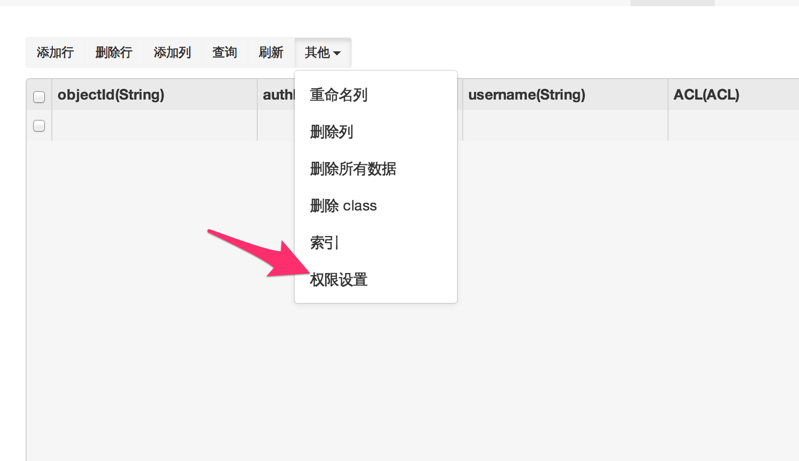
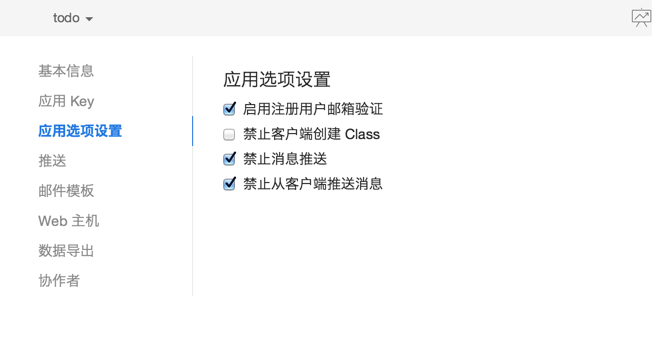
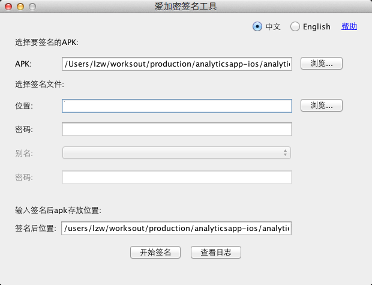
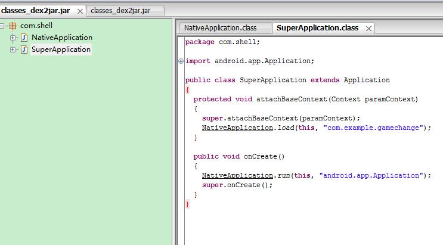

# 数据和安全

## 数据

### 有效的数据类型

我们已经仔细设计并实现了客户端SDK，在你使用iOS或者Android SDK的时候，通常来说你不需要担心数据是如何保存的。只要简单地往 `AVObject` 添加数据，它们都能被正确地保存。

尽管如此，有些情况下了解数据如何存储在LeanCloud平台上还是有一些用处。

在平台内部，LeanCloud将数据存储为JSON，因此所有能被转换成JSON的数据类型都可以保存在LeanCloud平台上。并且，框架还可以处理日期、Bytes以及文件类型。总结来说，对象中字段允许的类型包括：

* String 字符串
* Number 数字
* Boolean 布尔类型
* Array 数组
* Object 对象
* Date 日期
* Bytes base64编码的二进制数据
* File  文件
* Null 空值

Object类型简单地表示每个字段的值都可以由能JSON编码的内嵌对象组合而成。对象的Key（键）包含`$`或者`.`，或者同时有`__type`的键，都是框架内保留用来做一些额外处理的特殊键，因此请不要在你的对象中使用这样的Key。

我们的SDK会处理原生的Objective-C和Java类型到JSON之间的转换。例如，当你保存一个NSString对象的时候，它在我们的系统中会被自动转换成String类型。

有两种方式可以存储原生的二进制数据。Bytes类型允许直接在AVObject中关联NSData或者bytes[]类型的数据。这种方式只推荐用来存储小片的二进制数据。当要保存实际文件（例如图片，视频，文档等），请使用AVFile来表示File类型，并且File类型可以被保存到对象字段中关联起来。

### 数据类型锁定

当一个class初次创建的时候，它不包含任何预先定义并继承的schema。也就是说对于存储的第一个对象，它的字段可以包含任何有效的类型。

但是，当一个字段被保存至少一次的时候，这个字段将被锁定为保存过的数据类型。例如，如果一个Userd对象保存了一个字段name，类型为String，那么这个name字段将被严格限制为只允许保存String类型。（如果你尝试保存其他类型到这个字段，我们的SDK会返回一个错误）

一个特例是任何字段都允许被设置为null，无论它是什么类型。

### 数据管理

[数据管理](/data.html?appid={{appid}})是一个允许你在你的任何App里更新或者创建对象的一个Web UI管理平台。在这里，你可以看到保存在class里的每个对象的原生JSON值。

当使用这个平台的时候，请牢记：

* 输入"null"将会设置值为特殊的空值null，而非字符串"null"
* objectId,createdAt和updatedAt不可编辑（它们都是系统自动设置的）。
* 下划线开始的class为系统内置class，不可删除，并且请轻易不要修改它的默认字段，可添加字段。


### 导入数据

除了REST api之外，我们还提供通过 JSON 文件和 CSV 格式文件的导入数据的功能。

为了通过JSON文件创建一个新Class，请到[数据管理](/data.html?appid={{appid}})并点击左侧class导航的"数据导入"按钮。

**数据文件的扩展名必须是`.csv`或者`.json`结尾，我们根据这个来判断导入数据的类型。**

#### JSON文件格式

JSON格式要求是一个符合我们REST格式的JSON对象数组，或者一个JSON对象包含results字段，对应的是一个对象数组。

一个包含普通对象的文件看来像这样：

```
{ "results": [
  {
    "score": 1337,
    "playerName": "Sean Plott",
    "cheatMode": false,
    "createdAt": "2012-07-11T20:56:12.347Z",
    "updatedAt": "2012-07-11T20:56:12.347Z",
    "objectId": "fchpZwSuGG"
  }]
}
```

导入用户数据，密码需要一个特殊的字段`bcryptPassword`，并且完全遵循[Stackoverflow帖子里描述的加密算法加密后](http://stackoverflow.com/a/5882472/1351961)，将导入作为用户密码。

关联Relation数据的导入，需要填写导入的class名称，导入后的字段名称，关联的class名称等信息，才能完整导入，示范的relation数据类似：

```
{ "results": [
{
  "owningId": "dMEbKFJiQo",
  "relatedId": "19rUj9I0cy"
},
{
  "owningId": "mQtjuMF5xk",
  "relatedId": "xPVrHL0W4n"
}]}
```
其中：

* owningId 是将要导入的class表内已经存在的对象的objectId。
* relatedId 是将要关联的class里的对象的objectId。

例如Post有一个字段comments是relation类型，对应的Class是Comment，那么owningId就是已存在的Post的objectId，而relatedId就是关联的Comment的ObjectId。

### CSV格式文件

导入Class的 csv 文件格式必须符合我们的扩展要求：

* 第一行必须是字段的类型描述，支持`int`,`long`,`number`,`double`,`string`,`date`,`boolean`,`file`,`array`,`object`等。
* 第二行是字段的名称
* 第三行开始才是要导入的数据

例如：

```
string,int,string,double,date
name,age,address,account,createdAt
张三,33,北京,300.0,2014-05-07T19:45:50.701Z
李四,25,苏州,400.03,2014-05-08T15:45:20.701Z
王五,21,上海,1000.5,2012-04-22T09:21:35.701Z

```

导入的relation数据，比JSON简单一些，第一列对应JSON的`owningId`，也就是要导入的 Class 的存在对象的 objectId，第二列对应`relatedId`，对应关联 Class 的objectId。例如：

```
dMEbKFJiQo,19rUj9I0cy
mQtjuMF5xk,xPVrHL0W4n
```

### 导出数据

我们还支持您可以导出所有的应用数据（不包括用户密码），只要进入 [应用设置->数据导出](/app.html?appid={{appid}}#/export) 点击导出按钮即可开始导出任务。我们将在导出完成之后发送下载链接到您的注册邮箱。

导出还可以限定日期，我们将导出在限定时间内有过更新或者新增加的数据。

## 安全性

对于任何移动应用来说。因为客户端代码运行在一台移动设备上，因此可能会有不受信任的客户强行修改代码并发起恶意的请求。选择正确的方式来保护你的应用非常重要，但是正确的方式取决于你的应用，以及应用存储的数据。

LeanCloud提供多种方式使用权限控制来获得安全性。如果你有关于任何保护你应用安全的最佳方式的问题，我们都鼓励你联系我们的客户支持。

### SSL 加密传输

首先，我们所有的API请求都通过[SSL加密传输](http://zh.wikipedia.org/wiki/%E5%AE%89%E5%85%A8%E5%A5%97%E6%8E%A5%E5%B1%82)，保证传输过程中的数据安全性和可靠性。

### 对象级别的权限

最灵活的保护你应用数据安全的方式是通过访问控制列表(access control lists)，通常简称为ACL机制。ACL背后的思想是为每个对象关联一系列User或者Role，这些User或者Role包含了特定的权限。一个User必须拥有读权限（或者属于一个拥有读权限的Role）才可以获取一个对象的数据，同时，一个User需要写权限（或者属于一个拥有写权限的Role）才可以更改或者删除一个对象。

大多数应用都通过ACL来规范它们的访问模式。例如：

* 对于私有数据，"read"和"write"都可以限制为对象拥有者(owner)所有。
* 一个信息公告板的帖子，作者和属于"版主"角色的成员可拥有"write"权限，通常public允许"read"访问（也就是允许公开读取帖子）。
* 高优先级用户或者开发者创建的数据，例如全局的每日广播消息，可以让public拥有"read"许可，但是严格限制"write"权限给"管理员"角色。
* 一条从一个用户发往另一个用户的消息，可以将读和写的访问许可限制到关联的这两个用户。

使用 LeanCloud SDK，你可以设置一个默认的ACL给客户端所有创建的对象。如果你同时开启自动匿名用户创建的功能，你可以保证你的数据拥有严格限制到每个单独用户的ACL权限。请仔细阅读iOS和Android指南关于选择默认安全策略的章节。

通过设置Master Key的REST API，你还是可以绕过ACL限制执行任何操作。这可以让开发者更容易的管理数据。例如，你可以通过REST API删除一条私有消息，哪怕这条消息设置为拥有者私有。

代码中如何使用ACL，请阅读iOS开发指南或者Android开发指南的ACL部分。


### Class 级别的权限

在一些情况下，设置整个class允许的权限是一种更自然的方式。例如，你可能想设置整个Class只读，或者只写。

为了简单地做到这一点，LeanCloud让你可以设置每个class允许的操作。为了访问这些设置，请进入数据管理平台，选择一个class，并点击右侧菜单中的 "其他"下拉框找到权限设置。



你可以为选中的class禁止客户端执行下列操作的能力：

* GET - 通过objectId获取对象。
* Find - 发起一次对象列表查询。
* Update - 保存一个已经存在并且被修改的对象。
* Create - 保存一个从未创建过的新对象。
* Delete - 删除一个对象。
* Add fields - 添加新字段到class

### App安全选项

进入应用设置菜单，在左侧菜单可以看到`应用选项设置`，目前支持4个选项：



点击选中或者取消选中就可以启用或者关闭这些选项，大概介绍下功能：

* 启用注册用户邮箱验证: 是否要求您应用里的注册用户验证邮箱， 默认不启用。如果启用，每次用户注册，都会发送一封邮件到用户提供的邮箱，要求认证，具体请看开发指南里的用户一节。
* 禁止客户端创建 Class:  是否禁止客户端动态创建 Class。如果启用，那么通过SDK或者REST API都没办法动态创建不存在的 Class 了，这种情况下只能通过我们的数据管理平台来创建新 Class。]
* 禁止消息推送: 是否彻底禁止消息推送。如果启用，任何消息推送的调用都不允许。
* 禁止从客户端推送消息: 是否禁止从客户端推送消息，如果启用，这那么通过SDK或者REST API都被禁止推送消息，只能通过我们管理平台提供的推送界面来推送消息。

## 第三方加密

对于 Android 应用，除了代码混淆之外，还可以使用第三方加密工具，隐藏 classes.dex，通过动态加载的方法进一步提高应用的安全性。下面我们简单介绍一下爱加密。

### 爱加密

[爱加密](http://www.ijiami.cn/)是专为移动开发者提供安全服务的一个平台，可解决开发者面临的 App 安全问题。

加密的步骤很简单，

* 提交应用
* 下载加密后的 apk 文件
* 下载爱加密提供的签名工具，对应用进行签名

相关步骤还可以见下面的截图。

申请账号，提交应用，下载签名工具：


加密后重新签名：




这样得到的 apk 文件，普通的反编译之后得到的是，




可以看到，代码被隐藏起来了，应用被破解的难度大幅增加了。

我们一直努力提供更多功能给开发者来保护您的应用，也希望大家持续地给我们反馈，感谢。
