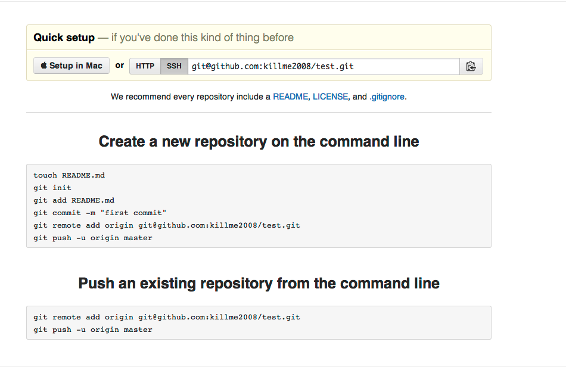

# LeanEngine 指南

## 介绍

之前 LeanCloud 的[云代码](../cloud_code_guide.html)可以支持用户将自己的代码上传至我们的服务器上，来做一些自定义逻辑，以及拦截数据存储的 API 请求，做自定义的操作，以及 web hosting 功能，架设自己的网站。

现在我们将云代码的功能做了升级，开放性更高，并且更名为「LeanEngine」。老的云代码产品将继续运行并且维护下去，但是云代码上的功能都可以在 LeanEngine 实现，并且自由度更高，因此我们强烈建议您将您的项目改为 LeanEngine 实现。

### 与云代码的区别

* 多语言支持，目前支持 Node.js 与 Python，将来会支持更多的编程语言运行环境。
* 标准的运行环境，之前云代码是我们订制的一个沙箱运行环境，功能受限，并且代码只可以在云代码环境运行，难以迁移到自己搭建的后段服务器上。

## 创建项目

### node.js

首先请安装好 [node.js](https://nodejs.org/) 与 [npm](https://www.npmjs.com/)。

**注意**： 目前 LeanEngine 的 node.js 版本为 0.12，请您最好使用此版本的 node.js 进行开发，至少不要低于 0.10 。

创建一个叫做 `HelloLeanEngine` 的文件夹，作为项目的根目录。

在 `HelloLeanEngine` 目录中执行 `npm init`，接下来跟随 `npm` 向导，其中 `entry point` 请填入 `server.js`，其他根据您的情况自行选择（也可以全部选择默认值）。

接下来您的项目根目录下应该有了一个 `package.json` 文件。LeanEngine 是根据此文件来判断该项目的运行时语言为 node.js 的。

在项目根目录下执行 `npm install express --save`，这样会将 `express` 模块安装到当前目录，并且将依赖写入进 `package.json`，您的代码中就可以使用 `express` 了。

创建一个 `server.js` 的文件。这个文件将作为入口文件被 LeanEngine 执行。将下面内容填入 `server.js`：

```js
var express = require('express');

var app = express();

app.get('/', function(req, res) {
  res.send('hello world!');
});

app.get('/1/ping', function(req, res) {
  res.send('pong');
});

app.listen(parseInt(process.env.LC_APP_PORT || 3000, 10));
```

**注意**： `/1/ping` 这个页面的请求是必须的，LeanEngine 会定期去访问您的项目的此地址，检测项目可用性。

#### 本地运行

在项目根目录中执行 `npm start`，打开浏览器，访问 [http://localhost:3000/]() 即可访问您的项目。

#### 其他框架

LeanEngine 支持任意 node.js 的 web 框架，您可以使用您最熟悉的框架进行开发，或者不使用任何框架，直接使用 node.js 的 http 模块进行开发。但是请保证通过执行 `server.js` 能够启动您的项目，启动之后程序监听的端口为 `process.env.LC_APP_PORT`。

### Python

首先请安装好 [python](https://www.python.org/) 与 [pip](https://pip.pypa.io/)。

**注意**： 目前 LeanEngine 的 Python 版本为 2.7，请您最好使用此版本的 Python 进行开发。Python 3 的支持正在开发中。

创建一个叫做 `HelloLeanEngine` 的文件夹，作为项目的根目录。

在您的项目根目录创建一个 requirements.txt 的文件，填入以下内容：

```
flask
```

在项目根目录执行 `pip install -r requirements.txt`。这样即可将 flask 安装至系统。

**注意**： 推荐您使用 [virtualenv](https://virtualenv.pypa.io) 来将当前项目的第三方依赖与系统全局依赖做隔离，防止不同项目之间依赖的版本冲突。

创建 `app.py`：

```python
# coding: utf-8

from flask import Flask

app = Flask(__name__)


@app.route('/')
def index():
    return 'Hello, World!'


@app.route('/1/ping')
def ping():
    return 'pong'
```

**注意**： `/1/ping` 这个页面的请求是必须的，LeanEngine 会定期去访问您的项目的此地址，检测项目可用性。

创建 `wsgi.py`：

```python
# coding: utf-8

from wsgiref import simple_server

from app import app

application = app


if __name__ == '__main__':
	server = simple_server.make_server('localhost', 8000, application)
	server.serve_forever()
```

#### 本地运行

在您的项目根目录执行 `python wsgi.py`，访问 [http://localhost:3000/]() 即可访问您的项目。

#### 使用其他框架

LeanEngine 支持任意 python 的 web 框架，您可以使用您最熟悉的框架进行开发。但是请保证 `wsgi.py` 文件中有一个全局变量 `application`，值为一个 wsgi 函数。

## 部署

首先，你需要将这个项目提交到一个 git 仓库，LeanCloud并不提供源码的版本管理功能，而是借助于git这个优秀的分布式版本管理工具。我们推荐您使用[CSDN Code平台](https://code.csdn.net/)，[github](https://github.com/)或者[BitBucket](https://bitbucket.org/)这样第三方的源码
托管网站，也可以使用您自己搭建的git仓库(比如使用[gitlab.org](http://gitlab.org/))。下面我们详细描述下怎么使用。

### 使用 CSDN Code 托管源码

CSDN CODE是国内非常优秀的源码托管平台，您可以使用CODE平台提供公有仓库和有限的私有仓库完成对代码的管理功能。

以下是使用CODE平台与LeanCloud云代码结合的一个例子。
首先在CODE上创建一个项目


**提示**：在已经有项目代码的情况下，一般不推荐”使用README文件初始化项目”

接下来按照给出的提示，将源代码push到这个代码仓中

```sh
cd ${PROJECT_DIR}
git init
git add *
git commit -m "first commit"
git remote add origin git@code.csdn.net:${yourname}/test.git
git push -u origin master
```

我们已经将源码成功推送到CODE平台，接下来到LeanCloud云代码的管理界面填写下你的git地址（请注意，一定要填写以`git@`开头的地址，我们暂不支持https协议clone源码）并点击save按钮保存：


添加 deploy key 到你的 CODE 平台项目上（deploy key是我们LeanCloud机器的ssh public key）
保存到”项目设置””项目公钥”中，创建新的一项avoscloud:


下一步，部署源码到测试环境，进入 云代码 -> Git 部署 菜单，点击「部署到开发环境」的部署按钮：


部署成功后，可以看到开发环境版本号从 undeploy 变成了当前提交的源码版本号。


### 使用 GitHub 托管源码

使用BitBucket与此类似，不再赘述。

[Github](https://github.com)是一个非常优秀的源码托管平台，您可以使用它的免费帐号，那将无法创建私有仓库(bucket可以创建私有仓库)，也可以付费成为高级用户，可以创建私有仓库。

首先在github上创建一个项目，比如就叫`test`:




接下来按照github给出的提示，我们将源码push到这个代码仓库：

```sh
cd ${PROJECT_DIR}
git init
git add *
git commit -m "first commit"
git remote add origin git@github.com:${yourname}/test.git
git push -u origin master
```

到这一步我们已经将源码成功push到github，接下来到Cloud Code的管理界面填写下你的git地址（请注意，一定要填写以`git@`开头的地址，我们暂不支持https协议clone源码）并点击save按钮保存：


并添加deploy key到你的github项目（deploy key是我们Cloud code机器的ssh public key），如果您是私有项目，需要设置deploy key，

拷贝 `设置` 菜单里的 `Deploy key` 保存到 github setting 里的deploy key，创建新的一项avoscloud:


下一步，部署源码到测试环境，进入 云代码 -> Git 部署 菜单，点击「部署到开发环境」的部署按钮：


部署成功后，可以看到开发环境版本号从 undeploy 变成了当前提交的源码版本号。

### Gitlab 无法部署问题

很多用户自己使用[Gitlab](http://gitlab.org/)搭建了自己的源码仓库，有朋友会遇到无法部署到LeanCloud 的问题，即使设置了Deploy Key，却仍然要求输入密码。

可能的原因和解决办法如下：

* 确保您gitlab运行所在服务器的/etc/shadow文件里的git（或者gitlab）用户一行的`!`修改为`*`，原因参考[这里](http://stackoverflow.com/questions/15664561/ssh-key-asks-for-password)，并重启SSH服务`sudo service ssh restart`。
* 在拷贝deploy key时，确保没有多余的换行符号。
* Gitlab目前不支持有comment的deploy key。早期LeanCloud 用户生成的deploy key可能带comment，这个comment是在deploy key的末尾76个字符长度的字符串，例如下面这个deploy key:

```
ssh-rsa AAAAB3NzaC1yc2EAAAABIwAAAQEA5EZmrZZjbKb07yipeSkL+Hm+9mZAqyMfPu6BTAib+RVy57jAP/lZXuosyPwtLolTwdyCXjuaDw9zNwHdweHfqOX0TlTQQSDBwsHL+ead/p6zBjn7VBL0YytyYIQDXbLUM5d1f+wUYwB+Cav6nM9PPdBckT9Nc1slVQ9ITBAqKZhNegUYehVRqxa+CtH7XjN7w7/UZ3oYAvqx3t6si5TuZObWoH/poRYJJ+GxTZFBY+BXaREWmFLbGW4O1jGW9olIZJ5/l9GkTgl7BCUWJE7kLK5m7+DYnkBrOiqMsyj+ChAm+o3gJZWr++AFZj/pToS6Vdwg1SD0FFjUTHPaxkUlNw== App dxzag3zdjuxbbfufuy58x1mvjq93udpblx7qoq0g27z51cx3's cloud code deploy key
```
其中最后76个字符

```
App dxzag3zdjuxbbfufuy58x1mvjq93udpblx7qoq0g27z51cx3's cloud code deploy key
```

就是comment，删除这段字符串后的deploy key(如果没有这个字样的comment无需删除)保存到gitlab即可正常使用:

```
ssh-rsa AAAAB3NzaC1yc2EAAAABIwAAAQEA5EZmrZZjbKb07yipeSkL+Hm+9mZAqyMfPu6BTAib+RVy57jAP/lZXuosyPwtLolTwdyCXjuaDw9zNwHdweHfqOX0TlTQQSDBwsHL+ead/p6zBjn7VBL0YytyYIQDXbLUM5d1f+wUYwB+Cav6nM9PPdBckT9Nc1slVQ9ITBAqKZhNegUYehVRqxa+CtH7XjN7w7/UZ3oYAvqx3t6si5TuZObWoH/poRYJJ+GxTZFBY+BXaREWmFLbGW4O1jGW9olIZJ5/l9GkTgl7BCUWJE7kLK5m7+DYnkBrOiqMsyj+ChAm+o3gJZWr++AFZj/pToS6Vdwg1SD0FFjUTHPaxkUlNw==
```

## 环境变量

LeanEngine 上有一些平台相关的环境变量，可以在您的代码中使用。

* `LC_APP_ID`: 当前应用的 App Id
* `LC_APP_KEY`: 当前应用的 App Key
* `LC_APP_MASTER_KEY`: 当前应用的 Master Key
* `LC_APP_ENV`: 当前应用环境，测试环境值为 `test`，生产环境值为 `production`
* `LC_APP_PORT`: 当前应用开放给外网的端口，只有监听此端口，用户才可以访问到您的服务


## 使用数据存储

您可以直接在 LeanEngine 上使用我们的[数据存储](https://leancloud.cn/features/storage.html)服务。

### node.js

在您的项目根目录下，执行 `npm install avoscloud-sdk` 来安装 LeanCloud JavaScript SDK，之后您就可以在项目中使用了。

在正式使用数据存储 API 之前，您需要使用自己的应用 key 进行设置。

```js
var AV = require('avoscloud-sdk').AV;

APP_ID = process.env.LC_APP_ID || 'your_app_id';
APP_KEY = process.env.LC_APP_KEY || 'your_app_key';
MASTER_KEY = process.env.LC_APP_MASTER_KEY || 'your_master_key';

AV.initialize(APP_ID, APP_KEY, MASTER_KEY);
```

请保证在使用任何数据存储功能前执行这段代码，我们推荐将这段代码放在 `server.js` 文件前面的位置。

数据存储相关功能请参考 [JavaScript SDK](./js_guide.html)。


### Python

在您的项目 `requirements.txt` 中增加一行新的依赖：

```
leancloud-sdk
```

之后执行 `pip install -r requirements.txt`来安装 LeanCloud Python SDK。

在正式使用数据存储 API 之前，您需要使用自己的应用 key 进行设置。

```python
import os
import leancloud

APP_ID = os.environ.get('LC_APP_ID', 'your_app_id')
MASTER_KEY = os.environ.get('LC_APP_MASTER_KEY', 'your_master_key')

leancloud.init(APP_ID, master_key=MASTER_KEY)
```

请保证在使用任何数据存储功能前执行这段代码。

数据存储相关功能请参考 [Python SDK](./python_guide.html)。


## Cloud Func 与 Cloud Hook

使用 Cloud Func 功能，您可以定义一些简单的逻辑在 LeanEngine 上运行，使用 LeanCloud 各个语言的 SDK，可以方便的调用这些函数。

Cloud Hook 功能可以定义一些逻辑，在您访问 LeanCloud 数据存储 API 时，拦截一些 API 请求，在请求前或者请求后执行自己想要的逻辑，修改保存的对象，做一些数据校验等工作。

### node.js

TODO

### python

#### 安装

首先您需要安装 leancloud-cloudcode-sdk 这个模块。在您的项目 `requirements.txt` 中增加一行新的依赖：

```
leancloud-cloudcode-sdk
```

之后执行 `pip install -r requirements.txt` 来安装。cloudcode 模块是作为一个 Python WSGI 中间件来实现的，您需要在 wsgi.py 中在您的 app 上安装此中间件：

```python
# coding: utf-8

import cloudcode
from wsgiref import simple_server

from app import app

application = cloudcode.CloudCode(app)


if __name__ == '__main__':
	server = simple_server.make_server('localhost', 8000, application)
	server.serve_forever()
```

这样您的应用的 `/1/functions` 和 `/1.1/functions` 的路径将会在中间件中处理，其中包含了 Cloud Func 与 Cloud Hook 内部使用的 URL。因此您的应用中不应该处理这两个地址开头的 URL。

#### Cloud Func

您可以这样定义一个 Cloud Func：

```python
import cloudcode

@cloudcode.cloud_func
def hello():
	return 'Hello, World!'
```

将项目部署到 LeanEngine 环境上之后，您可以使用 REST API 来访问这个 Cloud Func：

```bash
curl -X POST -H "Content-Type: application/json; charset=utf-8"   \
       -H "X-AVOSCloud-Application-Id: ige9yk2v2jxb0a2sfhw325ezbdzdgpmiy3gmtj31df9nwo84"          \
       -H "X-AVOSCloud-Application-Key: difvp55b80gg57r5rzwdmnwwieq8mvsioxf8jwvipl366tzz"        \
       -H "X-AVOSCloud-Application-Production: 0"  -d '{}' \
https://leancloud.cn/1.1/functions/hello
```

返回结果：

```json
{"result":"Hello, World!"}
```

另外您可以使用任意客户端的 LeanCloud SDK 调用此 Cloud Func。
