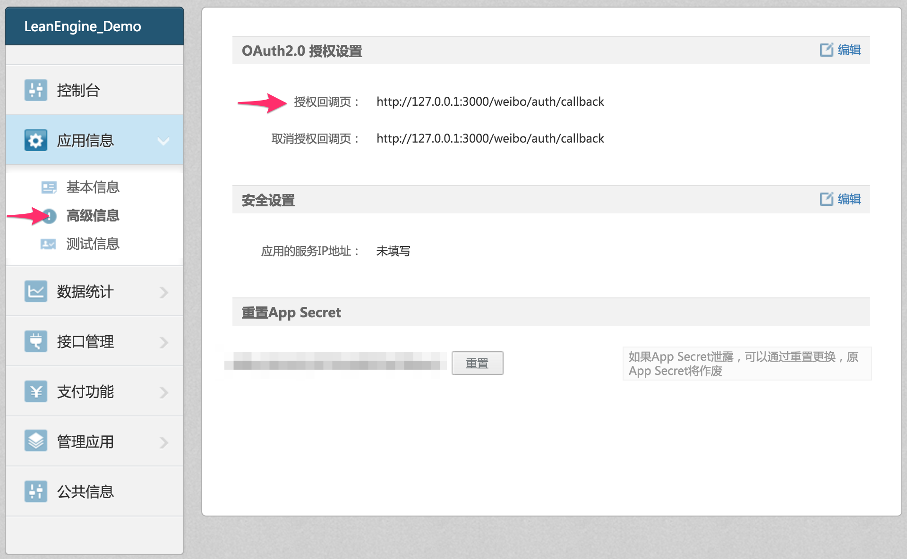

# 微博 OAuth 授权验证回调服务器开发指南

阅读本文前，请确保您已准确理解了 [OAuth 2](http://oauth.net/2/) 以及 [微博登录](http://open.weibo.com/wiki/%E6%8E%88%E6%9D%83%E6%9C%BA%E5%88%B6)

## 场景设定
本文档的主要是指导开发者使用 LeanEngine 作为微博 OAuth 授权验证回调服务器，因此我们设定了一个场景，我们根据场景设定的需求逐步演示实现的过程。

一个简单的场景如下就是实现微博登录，然后发一条微博。

## 微博后台设置
这一部分请参考[微博开放平台的文档](http://open.weibo.com/wiki/%E6%96%B0%E6%89%8B%E6%8C%87%E5%8D%97)


### 获取微博应用 App ID 以及 App Secret
登录到 [微博 &middot; 开放平台](http://open.weibo.com/) > **我的应用**，选择一个应用，再选择 **应用信息** > **基本信息** 即可看到 App Key 和 App Secret，将其复制到一个临时的文本文件中以备后用。


```
登录到 [微博 &middot; 开放平台](http://open.weibo.com/) > **我的应用**，选择一个应用，再选择 **应用信息** > **基本信息** 即可看到 App Key 和 App Secret。


```
### 设置回调页
登录到 [微博 &middot; 开放平台](http://open.weibo.com/) > **我的应用**，选择一个应用，再选择 **应用信息** > **高级信息** > **OAuth2.0 授权设置** > 授权回调页、取消授权回调页；点击 **编辑**，输入相应的回调链接，如 `http://127.0.0.1:3000/weibo/auth/callback`。


登录到 [微博 &middot; 开放平台](http://open.weibo.com/) > **我的应用**，选择一个应用，再选择 **应用信息** > **高级信息** > **OAuth2.0 授权设置** > 授权回调页、取消授权回调页；点击 **编辑**，输入相应的回调链接，如 `http://127.0.0.1:3000/weibo/auth/callback`。



## 创建项目
在 [LeanCloud 控制台](https://leancloud.cn/applist.html#/apps)中创建一个应用，暂且叫做「Weibo_OAuth」
在本地创建一个项目文件夹（比如 `/usr/leancloud/weibo_oauth/`），并执行以下命令行：：

```bash
cd /usr/leancloud/weibo_oauth/
avoscloud new
```

然后进入 [LeanCloud 控制台](/app.html)，选择刚才创建的应用，再选择 [**设置** > **应用 Key**](https://leancloud.cn/app.html?appid={{appid}}#/general)，找到 App ID 以及 Master Key 并复制。

回到命令行工具，它会要求你输入 App ID 以及 Master Key，输入完成之后，可以看见在 `/usr/leancloud/weibo_oauth/` 下就创建了一个 LeanEngine 默认的模板项目，打开 `app.js` 文件，然后请打开如下 GitHub 上托管的完整的微博 OAuth 授权验证回调服务器项目：[使用 LeanEngine 托管国内 OAuth 回调服务器](https://github.com/leancloud/LeanEngine-OAuth-China/)，打开此项目下的 `app.js` 文件（建议克隆到本地）
登录
## 编写代码
### 添加依赖包
打开 `package.json` 文件，替换成如下内容：

```js
{
  "name": "LeanEngine-OAuth-Sample",
  "version": "1.0.0",
  "description": "LeanEngine Weibo OAuth 2 sample project.",
  "main": "server.js",
  "scripts": {
    "start": "node server.js"
  },
  "keywords": [
    "node",
    "LeanCloud",
    "LeanEngine",
    "express",
    "weibo",
    "OAuth"
  ],
  "license": "MIT",
  "dependencies": {
    "body-parser": "1.12.3",
    "cookie-parser": "^1.3.5",
    "ejs": "2.3.1",
    "express": "4.12.3",
    "leanengine": "^0.4.0",
    "passport": "^0.3.2",
    "passport-weibo": "^0.1.2",
    "request": "^2.69.0"
  }
}
```
### weibo.js
参照[weibo.js](https://github.com/leancloud/LeanEngine-OAuth-China/blob/master/routes/weibo.js) 的代码，建议直接复制拷贝所有内容，全部覆盖本地的(`/usr/leancloud/weibo_oauth/routes/weibo.js`)里面的内容，如果没有的话就直接复制到对应的目录下，然后找到关键的配置项修改。

```js
var router = require('express').Router(),
  passport = require('passport'),
  WeiboStrategy = require('passport-weibo').Strategy,
  request = require('request');

var WEIBO_CLIENT_ID = "在这里填写微博应用的 App ID";
var WEIBO_CLIENT_SECRET = "在这里填写微博应用的 App Secret";

var ACCESSTOKEN = "";

// passport 组件所需要实现的接口
passport.serializeUser(function(user, done) {
  done(null, user);
});

passport.deserializeUser(function(obj, done) {
  done(null, obj);
});

// passport 的  WeiboStrategy 所必须设置的参数
passport.use(new WeiboStrategy({
    clientID: WEIBO_CLIENT_ID, // App ID
    clientSecret: WEIBO_CLIENT_SECRET, // App Secret
    callbackURL: "http://127.0.0.1:3000/weibo/auth/callback" // 回调地址，此处是为了本地调试
  },
  function(accessToken, refreshToken, profile, done) {

    process.nextTick(function() {
      // 此处在服务端存储 ACCESSTOKEN 是为了后续发送微博所需要的必要参数
      // 实际生产项目中，是需要持久化存储这个 ACCESSTOKEN 到数据库里面
      ACCESSTOKEN = accessToken;
      console.log("accessToken:" + accessToken);
      return done(null, profile);
    });
  }
));

// 发起授权认证请求，用户主动发起
router.get('/auth/',
  passport.authenticate('weibo'),
  function(req, res) {
    // The request will be redirected to Weibo for authentication, so this
    // function will not be called.
  });

// 用户授权完整之后回调到这个路由
router.get('/auth/callback',
  passport.authenticate('weibo', {
    failureRedirect: '/'
  }),
  function(req, res) {
    // 如果授权了你的应用就会走到这个路由
    // 在当前实例下，我们设置用户授权成功之后，我们跳转到 share 路由下
    res.redirect('/weibo/share');
  });


router.get('/share',
  function(req, res) {
    // 跳转到这里之后，我们让用户跳转到发送微博的页面
    res.render('post', {}); //此处只是为了展现 post.ejs 页面
  });

// 这里调用了微博发送的接口，发送一条全新的微博
router.post('/post', function(req, res) {
  console.log(req.body.status);
  request.post({
    url: 'https://api.weibo.com/2/statuses/update.json',
    form: {
      access_token: ACCESSTOKEN,
      status: req.body.status
    }
  }, function(err, httpResponse, body) {
    if (err) {

    } else {
      console.log(httpResponse.body);
      res.send("分享成功！");
    }

  })
});

module.exports = router;
```

### app.js

在根目录下的 `app.js`需要配置的是两行代码，如下：

```js
'use strict';
. . .
var weibo = require('./routes/weibo'); // 这一段必须拷贝到当前项目中，它是定义了一个路由集合
var passport = require('passport');// 引用 passport 组件
. . .
```
启用 `passport` 组件：

```js
app.use(passport.initialize());
app.use(passport.session());
```

然后在后面引用定义过的这个路由集合：

```js
// 可以将一类的路由单独保存在一个文件中
app.use('/weibo', weibo);
```

### index.ejs
复制如下内容到覆盖 `index.ejs` 里面的内容：

```html
<!DOCTYPE HTML>
<html>
  <head>
    <title>LeanEngine 搭建 OAuth 回调服务器示例</title>
    <link href="//cdn.bootcss.com/flat-ui/2.2.2/css/vendor/bootstrap.min.css" rel="stylesheet">
    <link href="//cdn.bootcss.com/flat-ui/2.2.2/css/flat-ui.min.css" rel="stylesheet">
  </head>
  <body>
    <div class="container">
      <form class="form-signin">
        <h2 class="form-signin-heading">微博登录示例</h2>
        <a class="btn btn-primary btn-large btn-block" href="/weibo/auth">微博登录</a>
      </form>

    </div> <!-- /container -->
</html>
```

## 本地调试
在根目录下执行：
先执行：

```bash
npm install
```

如果无法科学上网，请配置 [cnpm](http://npm.taobao.org/)

然后执行：

```bash
avoscloud
```

然后打开[localhost:3000](http://localhost:3000)
就会看到如下截图：


然后就可以在本地完成授权 -> 回调 -> 发微博的流程

## 部署项目
回到 LeanCloud 控制台，选择刚创建的应用，再选择 [**存储** > **云引擎** > **设置** > Web 主机域名](/cloud.html?appid={{appid}}#/conf)，在这里为该应用设置二级域名。 


设置域名为：weibotest.leanapp.cn

然后回到项目目录下，执行如下命令行：

```bash
avoscloud deploy
``` 
这只是部署到预备环境，并没有真正发布到外网的线上，如果 deploy 成功之后，可以通过 `http://stg-weibotest.leanapp.cn` 来访问。若要正式对外发布到 `http://weibotest.leanapp.cn`，则执行如下命令行：

```bash
avoscloud publish
```

## 配置修改
因为是要回调到外网地址，因此需要回到微博开放平台的后台设置页面修改回调地址：

```
http://weibotest.leanapp.cn/weibo/auth/callback
```
而 `weibo.js` 中的配置项也需要对应的修改：

```js
passport.use(new WeiboStrategy({
    clientID: WEIBO_CLIENT_ID, // App ID
    clientSecret: WEIBO_CLIENT_SECRET, // App Secret
    callbackURL: "http://weibotest.leanapp.cn/weibo/auth/callback" //*此处也需要进行同样的设置*
    },
  function(accessToken, refreshToken, profile, done) {

    process.nextTick(function() {
      // 此处在服务端存储 ACCESSTOKEN 是为了后续发送微博所需要的必要参数
      // 实际生产项目中，是需要持久化存储这个 ACCESSTOKEN 到数据库里面
      ACCESSTOKEN = accessToken;
      console.log("accessToken:" + accessToken);
      return done(null, profile);
    });
  }
));
```

## 云端测试

打开你设置的二级域名的首页（当前实例是打开：http://weibotest.leanapp.cn ），就可以进行实例测试了。

