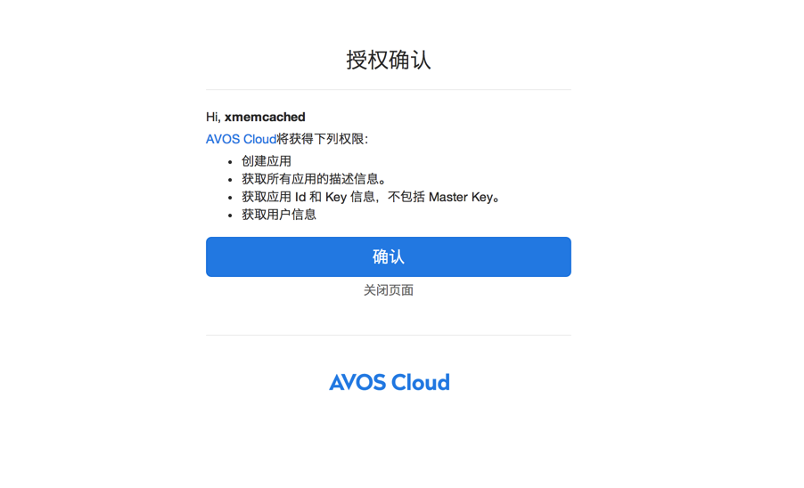

# AVOS Cloud 开放平台

我们提供了标准的 OAuth2 协议，允许第三方接入我们的平台，调用开放 API 获取用户信息、应用信息、创建应用等。

我们的开发者平台仍然在开发中，因此目前您需要通过帮助菜单的技术支持提出接入申请，要求提供下列信息：

* AVOS Cloud 帐户邮箱
* 申请者的详细信息：名称（个人或者公司）、地址、联系方式（手机或者电话）等。
* 申请的第三方平台的详细信息： 名称、介绍描述、网站地址
* 期望的接入方式： OAuth2 接入 或者 connect 方式接入，详情见下文。

在申请成功后，我们会发送 client id 和 client secret 提供给您接入。


## OAuth2 接入

目前 AVOS Cloud 支持的 OAuth2 授权方式仅限 [authorization_code](http://tools.ietf.org/html/draft-ietf-oauth-v2-25#section-4.1)。简单概括为：

* 第三方应用向 AVOS Cloud 请求授权
* AVOS Cloud 为用户展现一个授权页面（如果没有登录，则登录后显示授权页面，如果没有帐户，提供注册连接。），用户在此页面确认是否同意应用的请求
* 如果用户同意授权，第三方应用首先拿到一个 `code`，通过 code 请求 AVOS Cloud 获取用户的访问令牌`access_token`。
* 第三方应用使用 `access_token` 调用 AVOS Cloud 的开放 API。

AVOS Cloud 目前只支持服务器的WEB应用的授权流程（server-side flow）。并且暂不支持 access_token 的刷新机制。

### 第一步：申请授权

每个第三方应用都会分配一个 Client Key 和 Client Secret，用于鉴权。

第一步授权，将用户从浏览器内重定向到下列URL：

```
GET https://cn.avoscloud.com/1.1/authorize?client_id={{client_key}}&response_type=code&redirect_uri={{第三方应用的回掉URL}}&scope={{权限范围}}&state={{uuid}}
```

其中:

* client_id      （必须）应用分配的`Client Key`
* response_type  （必须）目前只支持 [authorization_code](http://tools.ietf.org/html/draft-ietf-oauth-v2-25#section-4.1)授权，因此请设置为`code`。
* scope          （必须）API授权范围，空格隔开的字符串列表，目前支持的 API 权限详见下文。
* redirect_uri   用户授权成功或者失败后，回掉第三方应用的 URL ，将会带上`code`值或者错误信息。
* state          （可选）状态信息，建议加上，内部应包含随机并且唯一的值，当 redirect_uri 回掉的时候会带上这个state返回，可以用来防止 CSRF 攻击。

调用这个 API 后， AVOS Cloud 会为用户展示一个授权页面：



假设 redirect_uri 为 `http://exmaple.com/oauth2/callback` ，那么当用户确认授权后，会加入code值重定向到这个 URL:

```
GET http://exmaple.com/oauth2/callback?state={{传入的state}}&code={{code随机码}}
```

**code 的有效时间是5分钟**。

`scope`目前支持：

* `client:info` 获取用户信息，默认必选
* `client:detail` 获取用户详细信息，包括联系方式等 (**敏感权限**)
* `app:info` 获取应用列表和信息，包括 app id，不包括 key 等敏感信息。
* `app:key` 获取应用的 app id 和 app key。(**敏感权限**)
* `app:create` 创建应用。
* `app:delete` 删除应用。

#### 第二步：获取令牌

用户授权后，您可以这回掉中拿到授权 code ，然后使用这个 code 去 AVOS Cloud 请求访问令牌(access_token)。服务端直接通过 http client 调用下列URL：

```
GET  https://cn.avoscloud.com/1.1/token?grant_type=authorization_code&client_id={{client_key}}&client_secret={{client_secret}}&code={{第一步返回的code}}&redirect_uri={{第一步使用的redirect_uri}}
```

其中`client_id`和`client_key`也可以作为 http basic 认证的用户名和密码传入。

各参数含义如下：
* grant_type 授权类型，同样，目前只支持`authorization_code`。
* client_id  也就是应用的 client key
* client_secret 也就是应用的 client secret
* code 第一步 redirect_uri 返回的 `code`
* redirect_uri 第一步使用的`redirect_uri`，必须完全一致。

调用成功，AVOS Cloud 将返回JSON格式数据：

```
{
  access_token: "29a3x72flkb3dy8bdsinexemh7n0h7z9",
  expires_in: 86400,
  token_type: "bearer",
  uid: 15
}
```

结果含义：

* token_type:  目前只支持`bearer`类型。
* access_token: 该用户授权给本应用的访问令牌
* expires_in: 过期时间，暂时可忽略。
* uid: 授权用户在 AVOS Cloud 上的唯一 ID。

## Connect 接入

对于部分合作伙伴，我们还提供了 `/1.1/connect` 的 API 用于快速接入。通过这个 API 可以直接创建或者获取用户帐号信息，用户不需要做授权，而是创建在该合作伙伴“namespace”下的帐号，跟 AVOS Cloud 平台上的帐号隔离。**也就是说，用户用同一个邮箱在 AVOS Cloud 上注册，第三方合作伙伴再拿这个邮箱到 AVOS Cloud 平台接入，两个帐号将是独立隔离的，前者在 AVOS Cloud 名下，而后者在第三方合作伙伴名下。**

`[GET | POST] /1.1/connect` API 接收下列参数：

```
[GET | POST] /1.1/connect?client_id={{client_id}}&email={{email}}&username={{username}}&timestamp={{timestamp}}&scope={{scope}}&sign={{sign}}
```

参数说明：

* client_id（必须）： 第三方平台分配到的应用 client key。
* email（必须）: 用户的帐户邮箱，AVOS Cloud 将使用该邮箱创建一个第三方平台名下的帐户，如果已经存在，则直接返回授权信息。
* username（可选）：用户的用户名，可选，如果不提供，将使用一个随机用户名。该用户名必须在 AVOS Cloud 平台上唯一。
* timestamp（必须）： Unix时间戳，精确到毫秒。这个时间戳不能跟 AVOS Cloud 服务端的时间间隔不能超过10秒。
* scope（必须）： 授权范围，请看[OAuth2接入第一步：申请授权](#第一步：申请授权)
* sign（必须）：请求签名，签名规则如下：

对除了sign之外的所有参数按照名称排序，并拼接到 URL "/1.1/connect?" 之后，形成下列字符串：

```
/1.1/connect?client_id={{client_id}}&email={{email}}&scope={{scope}}&timestamp={{timestamp}}&username={{username}}
```

**切记，不要对参数名和值，以及这个字符串做任何 URL encode 或者 escape 操作**

接下来，对这个路径字符串使用 `client secret` 和 [SHA256 Hmac](http://en.wikipedia.org/wiki/Hash-based_message_authentication_code)算法做签名，最终的值作为`sign`参数值。

我们举个例子，假设路径字符串最终为：

```
/1.1/connect?client_id=jl04l2081eczultsb7drrzxfxc5a30wh&email=test@example.com&scope=client:info app:info&timestamp=1405222829000&username=dennis
```

假设 client secret 是`s84rvq98u8j3wnklkznguo38vsvys6vo`：那么 sign 签名就是：

```
sha256_hmac("s84rvq98u8j3wnklkznguo38vsvys6vo", base_path) 
  =  0ed0e74ce6d4353e40fc3291747c7d1d2d9884b4c9a1e3c4da9d6bf8e4fe9b45
```

最终调用的 URL 就是：

```
https://cn.avoscloud.com/1.1/connect?client_id=jl04l2081eczultsb7drrzxfxc5a30wh&email=test@example.com&scope=client:info app:info&timestamp=1405222829000&username=dennis&sign=0ed0e74ce6d4353e40fc3291747c7d1d2d9884b4c9a1e3c4da9d6bf8e4fe9b45
```

SHA256 Hmac 签名要求都是采用 16 进制编码，而非 base64 等方式。Java 平台可以参考这篇[博客
](http://www.supermind.org/blog/1102/generating-hmac-md5-sha1-sha256-etc-in-java) 或者使用 [commons-codec](http://commons.apache.org/codec/) 库。 

下面给一段测试签名的 Ruby 代码：

```
    require 'openssl'

    timestamp = Time.now.to_i * 1000
    scope = "client:info app:info"
    client_id = "jl04l2081eczultsb7drrzxfxc5a30wh"
    client_secret = "s84rvq98u8j3wnklkznguo38vsvys6vo"
    email = "test@example.com"
    username = "dennis"

    base_url = "/1.1/connect?client_id=#{client_id}&email=#{email}&scope=#{scope}&timestamp=#{timestamp}&username=#{username}"

    sign = OpenSSL::HMAC.hexdigest(OpenSSL::Digest::Digest.new('SHA256'), client_secret, base_url)
    
    puts base_url
    puts sign
```

`/1.1/connect`的返回结果跟 OAuth2 的 `/1.1/token` 接口相同：

```
{
  access_token: "29a3x72flkb3dy8bdsinexemh7n0h7z9",
  expires_in: 86400,
  token_type: "bearer",
  uid: 15
}
```

接下来您就可以拿获取得到的 `access_token` 和 `uid` 去调用开放 API（在授权范围内）。

## 开放 API

获取令牌后，您可以使用令牌访问 AVOS Cloud 平台上的开放 API。

### 综述

调用下列 API 都需要传入授权得到的访问令牌 `access_token`，您可以:

* 在 API URL 中附加上 `access_token=xxx` 参数
* 或者使用`Authorization: Bearer xxx`的 HTTP 头（更推荐的方式）
 
来传入访问令牌。

所有开放 API 都以 `https://cn.avoscloud.com/1.1/open` 为前缀。
所有日期格式都为`YYYY-MM-DDTHH:MM:SS.MMMMZ`。

请求和应答都以 JSON 格式传输，请求请设置 `Content-Type: applicaiton/json;charset=utf-8` 的 HTTP 头。字符串编码为`UTF-8`。

### 错误信息：

错误信息也以 JSON 格式返回，形如：

```
{
   "code": 1,
   "error": "错误信息代码字符串",
   "error_description": "错误信息详细描述（附加）"
}
```

* code   是一个整型的错误代码，目前还没有细分。
* error  错误代码字符串，例如`invalid_scope`之类的错误代码。
* error_description  详细的错误信息，不一定返回。


### 获取用户信息

```
GET  /clients/:uid
```
* 参数： `uid`就是用户 id，令牌返回`params`值包含了`uid`，也可以用字符串`self`指代授权用户。
* 需要权限： `client:info`
* 应答结果：

```
{
username: "xzhuang",
created: "2013-10-16T21:52:31.000Z",
email: "xzhuang@avos.com",
id: 15
}
```

### 获取用户详细信息

```
GET  /clients/:uid/detail
```
* 参数： `uid`就是用户 id，令牌返回`params`值包含了`uid`，也可以用字符串`self`指代授权用户。
* 需要权限： `client:detail`
* 应答结果：

```
{
client_name: "xzhuang",
client_type: 1,
phone: "18xxxxxxxxxxx",
company_size: 2,
company_site: "https://avoscloud.com",
oicq: "xxxxxx"
……
}
```

其中

* client_type:  0 表示个人开发者， 1表示公司。
* company_size: 0表示个人，1表示20人以下，2表示200人以下，3表示1000人以下，4表示5000人以下，5表示5000人以上。

### 获取应用列表

```
GET /clients/:uid/apps
```
* 参数： `uid`就是用户 id，令牌返回`params`值包含了`uid`，也可以用字符串`self`指代授权用户。
* 需要权限： `app:info`
* 应答结果：

```
[
  {
    app_id: "blxzylt2g5e8l09zt875hl82nb8clydmvdjotv7ouudltkhj",
    client_id: 15,
    app_relation: "creator",
    yesterday_reqs: 0,
    app_name: "test",
    created: "2013-10-16T21:53:24.000Z",
    total_user_count: 17,
    client_username: "xzhuang",
    month_reqs: 18,
    app_domain: "test",
    id: 11,
     description: "测试测试"
  },
  {
    app_id: "mxrb5nn3qz7drek0etojy5lh4yrwjnk485lqajnsgjwfxrb5",
    client_id: 15,
    app_relation: "creator",
    yesterday_reqs: 0,
    app_name: "JS-SDK-Test",
    created: "2014-02-11T14:06:48.000Z",
    total_user_count: 26,
    client_username: "xzhuang",
    month_reqs: 1927,
    app_domain: null,
    id: 46,
    description: null
  }
]
```

### 获取单个应用信息

```
GET /clients/:uid/apps/:app_id
```
* 参数： `uid`就是用户 id，令牌返回`params`值包含了`uid`，也可以用字符串`self`指代授权用户。`app_id`就是应用 id。
* 需要权限： `app:info`
* 返回结果：

```
  {
    app_id: "mxrb5nn3qz7drek0etojy5lh4yrwjnk485lqajnsgjwfxrb5",
    client_id: 15,
    app_relation: "creator",
    yesterday_reqs: 0,
    app_name: "JS-SDK-Test",
    created: "2014-02-11T14:06:48.000Z",
    total_user_count: 26,
    client_username: "xzhuang",
    month_reqs: 1927,
    app_domain: null,
    id: 46,
    description: null
  }
```

### 获取应用 Key

```
GET /clients/:uid/apps/:app_id/key
```
* 参数： `uid`就是用户 id，令牌返回`params`值包含了`uid`，也可以用字符串`self`指代授权用户。`app_id`就是应用 id。
* 需要权限： `app:key`
* 返回结果：

```
{
app_key: "xxxxxxxxxxxxxxxxxxxxxxxxxxxxxxxxxxxxxxxxxxxxxx",
app_id: "blxzylt2g5e8l09zt875hl82nb8clydmvdjotv7ouudltkhj"
}
```

### 创建应用

```
POST /clients/:uid/apps
```
* 参数： `uid`就是用户 id，令牌返回`params`值包含了`uid`，也可以用字符串`self`指代授权用户。
* 需要权限：`app:create`
* 请求内容：

```
{
 "name": "应用名称，必须在授权用户帐户内唯一。",
 "description": "可选的描述信息"
}
```
* 应答内容：

```
{
{
  "created":"2014-06-27T16:46:12.000Z",
  "client_id":15,
  "app_name":"test33333",
  "app_key":"13pbblnbkqy0f4e9pav3n076gjzt5f3sta2ebglgwkg60n80",
  "app_id":"0bf4dvu6h0yhgyk95i2vgkjf3na9tif2gbk554ofen84c726"
}
```

### 删除应用

```
DELETE /clients/:uid/apps/:app_id
```
* 参数： `uid`就是用户 id，令牌返回`params`值包含了`uid`，也可以用字符串`self`指代授权用户。`app_id`就是应用 id。
* 需要权限： `app:delete`
* 返回结果：

```
  {
  }
```


