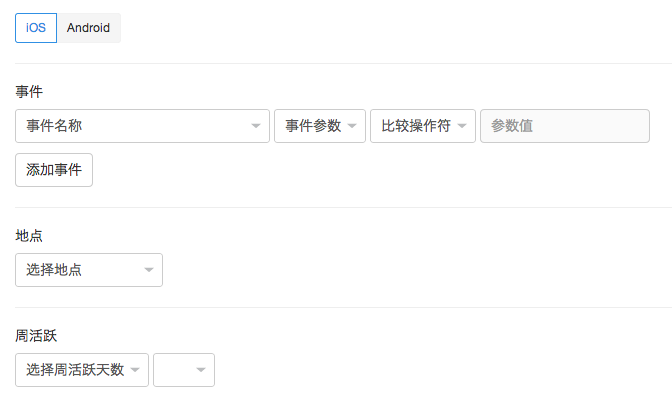
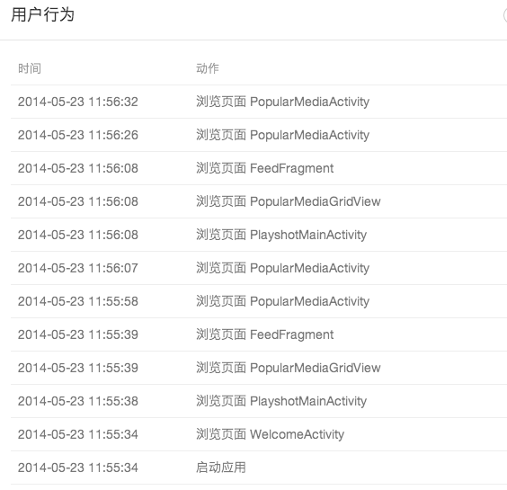
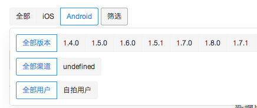

# 用户群分析
## 简介
用户群分析功能可以帮助开发者从所有使用APP的用户中，寻找出一部分符合某些条件的特殊用户，针对这些用户做更精细的分析挖掘。

目前提供的用户群功能可以将用户完成过的自定义事件作为搜索条件，找到符合这些条件的用户，观察这些用户在最近使用应用的一些具体行为。还可以将这些用户命名后定义成用户群保存，所有统计指标就有了根据这个用户群维度进行筛选。

## 例子
下面我们用一个例子演示一下使用方法：
### 自定义事件

要搜索用户，首先需要对用户的行为做一些记录跟踪。所以强烈推荐在应用开发的过程中合理的定义事件，记录下用户的关键行为。事件的定义可以参考文档 [Android 统计开发文档](./android_statistics.html#%E4%BD%BF%E7%94%A8%E8%87%AA%E5%AE%9A%E4%B9%89%E4%BA%8B%E4%BB%B6) 或 [iOS统计开发文档](./ios_statistics.html)。

### 搜索用户
在左侧菜单中选择用户群，点击筛选用户，进入用户群的主界面。

例如我们开发了一款视频应用，想了解到有哪些用户点击了自拍这个标签。就选择事件名称为ClickTag，其中的ClickTag参数值等于“自拍”。选择完成后，如图，得到了一批符合条件的用户列表。在这个列表中，可以看到这些用户所使用的设备型号，所在地，上次访问应用的时间和具体行为。当然，如果您还使用了LeanCloud的其他如数据存储和推送功能，我们可以把这些用户和User表的数据进行关联，或者对这些用户进行推送通知。

点击列表中的任何一个用户，就显示了这个用户在近期的活动。

### 消息推送

完成了用户群的筛选，我们就可以针对这些用户做一些特定操作，目前已经支持了用户群的 Push 信息推送。点击推送按钮，就可以进入信息推送的编辑页面，针对这些用户发送消息，如优惠活动信息。

### 收藏用户群
如果对搜索的结果满意，想进一步跟踪这些用户，并且利用系统的离线分析功能对这些用户进行分析，就可以点击“保存用户群”。这样可以方便以后继续查看，并且在所有指标的显示界面里，都可以看到以这个用户群作为筛选维度的菜单。选择后得到这个用户群的活跃度，用户行为等的分析数据。

